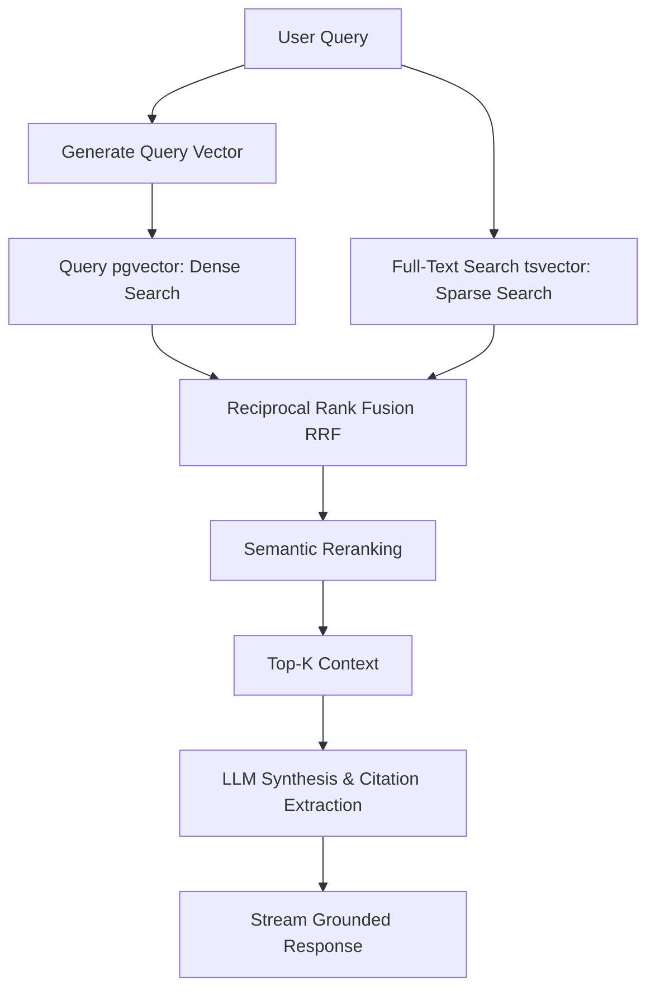

# ContextHub Developer Guidelines & AI Instructions (GEMINI.md)

Welcome to the **ContextHub** codebase. This document serves as the global instruction set and architectural standard for any AI assistants (like Gemini, Cursor, or Copilot) and human developers working on this project. 

Follow these instructions strictly to ensure the codebase remains maintainable, scalable, secure, and production-grade.

---

## 1. Technology Stack & Directory Structure

### Tech Stack
- **Frontend:** Next.js (TypeScript, App Router), React 19, Tailwind CSS (v4), Radix UI (primitives), Lucide React (icons).
- **Backend:** Python (FastAPI), Pydantic v2, SQLAlchemy (Async), PostgreSQL with `pgvector` (Vector database and relational metadata).
- **Caching & Queueing:** Redis (session caching, rate-limiting), Celery (background document processing and OCR).
- **AI Orchestration:** Custom Python implementation (direct API integrations with Gemini, OpenAI, Cohere), rather than heavy abstractions (e.g., LangChain).

### Workspace Layout
```text
context-hub/
├── backend/                  # FastAPI Application
│   ├── app/
│   │   ├── api/              # API Route Handlers (v1)
│   │   ├── core/             # Global configurations, security, DB connection
│   │   ├── modules/          # Domain-driven feature modules
│   │   │   ├── tenant/       # Tenant models, schemas, services
│   │   │   ├── auth/         # Auth & User models, schemas, services
│   │   │   ├── documents/    # Workspace, Document & Chunk models, schemas, services
│   │   │   └── audit/        # System activity logging models, schemas, services
│   │   ├── worker/           # Celery background tasks
│   │   ├── models_registry.py # Unified DB models metadata registry for Alembic
│   │   └── main.py           # FastAPI entry point
│   ├── tests/                # Pytest unit & integration tests
│   ├── pyproject.toml        # uv dependency management
│   └── Dockerfile
├── frontend/                 # Next.js Application
│   ├── src/
│   │   ├── app/              # Next.js App Router (pages & server actions)
│   │   ├── components/       # Reusable UI components (shadcn/radix patterns)
│   │   ├── hooks/            # Custom React hooks
│   │   ├── lib/              # Utility functions, API clients, and constants
│   │   └── types/            # TypeScript interface definitions
│   ├── tailwind.config.js    # Tailwind configuration
│   ├── package.json
│   └── Dockerfile
├── GEMINI.md                 # This file
├── PLAN.md                   # System Architecture & Specs
└── TASKS.md                  # Development Roadmap & Checklists
```

---

## 2. Logical Multi-Tenancy Rules

ContextHub uses **logical multi-tenancy** sharing a single PostgreSQL database. All client-specific data must be partitioned using a `tenant_id` column.

### Strict Database Access Constraints
1. **Model Requirement:** Every relational table (except global settings or shared static datasets) **must** contain a `tenant_id: UUID` column (or `ForeignKey("tenants.id", ondelete="CASCADE")`) and an index on `(tenant_id)`.
2. **Mandatory Query Filtering:** All queries (SELECT, UPDATE, DELETE) **must** explicitly filter by `tenant_id`. 
   - *Example (SQLAlchemy):* `select(Document).where(Document.tenant_id == current_tenant_id)`
   - Never write broad select queries without a tenant filter.
3. **Implicit Context Injection:**
   - On the backend, use a FastAPI dependency to extract `tenant_id` from the JWT token or authentication header.
   - Inject the resolved `tenant_id` into a thread-safe context variable (e.g., Python's `contextvars`) or pass it explicitly to every service layer function.
4. **Foreign Key Verification:** Before accessing nested resources (e.g., retrieving a `Chunk` belonging to a `Document`), verify that the parent `Document` belongs to the requesting `tenant_id`.

---

## 3. Custom RAG Architecture Guidelines

Do not install LangChain or LlamaIndex unless explicitly approved. Build custom, lightweight orchestration pipelines for flexibility, transparency, and latency optimization.



### Ingestion Pipeline Guidelines
- **Parser Engine:** Implement modular text parsers for `.pdf`, `.docx`, `.md`, `.txt`, `.csv`, and `.json`. For PDFs, extract metadata (headers, page numbers, coordinates for citations).
- **Chunking Strategy:** Use semantic-aware chunking. For documents, chunk by headings/paragraphs (approx. 500–1000 tokens) with a sliding window overlap (100 tokens). Always record structural metadata: `page_number`, `parent_header`, and `character_offsets`.
- **Embeddings:** Generate embeddings using `text-embedding-004` (Gemini) or `text-embedding-3-small/large` (OpenAI). Keep dimensions and normalization standard in the DB.

### Retrieval Pipeline Guidelines
- **Hybrid Search:** Implement a combined search in PostgreSQL:
  - **Dense Search:** Cosine similarity via `pgvector` indexes (HNSW).
  - **Sparse Search:** Full-text search using Postgres `tsvector` and `tsquery` with language-specific stemming.
- **Fusion (RRF):** Combine the rankings of Dense and Sparse searches using Reciprocal Rank Fusion (RRF) with a standard constant $k=60$.
- **Reranking:** Implement an optional reranking step using a local cross-encoder model or an API (e.g., Cohere Rerank or Gemini as a ranker) to optimize context window space.

### LLM Synthesis & Grounded Citations
- **Strict Grounding:** Prompt LLMs to answer questions **only** using the retrieved contexts. If the context does not contain the answer, respond with a standard fallback ("I cannot find the answer in the provided documents").
- **Inline Citations:** LLMs must output responses referencing source contexts in a strict format: `[^[id]]` or `[Document Name, p. X]`.
- **Source Verification:** The RAG service must parse these annotations and attach full citation metadata (document ID, name, excerpt, page number, character coordinate) in the structured JSON response payload.

---

## 4. Frontend & Tailwind CSS Development Standards

### Component & Styling Architecture
- **Tailwind CSS Rules:** 
  - Use standard Tailwind utility classes.
  - Do not use arbitrary styling (e.g., `h-[273px]` or `bg-[#ef45ac]`) where system theme design tokens exist. Use Tailwind config spacing, color tokens, and layout primitives.
  - Organize complex UI classes using Tailwind's `@utility` (Tailwind v4 style) or keep utility chains readable.
- **Design System:** Design must look and feel like a premium Enterprise SaaS. Focus on deep dark/light mode harmonized HSL color palettes, subtle glassmorphism (`backdrop-blur`), clean borders, transitions on hover states, and Outfit/Inter typography.
- **RSC vs. Client Components:**
  - Place data-fetching logic inside Next.js **Server Components** (RSCs) to minimize bundle sizes.
  - Mark only interactive UI elements (modals, forms, tabs, chat streams) with `'use client'`.

---

## 5. Security & Enterprise Compliance Rules

- **SSO & SAML:** Design the auth interface to support multi-tenant Identity Provider (IdP) configurations (SAML 2.0 / OIDC) using JWT validation keys on a per-tenant basis.
- **Audit Logging:** Every mutating request (Create, Update, Delete) must trigger a system event recorded in the `audit_logs` table. Format:
  ```json
  {
    "timestamp": "ISO-8601",
    "user_id": "UUID",
    "tenant_id": "UUID",
    "action": "DOCUMENT_DELETE",
    "resource_id": "UUID",
    "ip_address": "string",
    "payload_diff": { "before": {...}, "after": {...} }
  }
  ```
- **Data Loss Prevention (DLP):** Integrate pre-ingestion regex scanners for Personally Identifiable Information (PII) like SSNs, emails, credit card numbers, and API keys. Provide a configurable toggle per Workspace to mask or reject matching chunks.
- **Input Sanitization:** Avoid raw SQL execution. Always use parameterized SQLAlchemy ORM statements. Sanitize user-generated queries and document text before vector injection.

---

## 6. Testing & CI/CD Standards

- **Unit Testing:** Write Pytest mocks for LLM and embedding calls to prevent runaway API billing during test cycles.
- **Integration Testing:** Test logical multi-tenancy limits by writing tests where two different tenants attempt to query each other's objects, expecting 404/403 responses.
- **RAG Evaluation:** Periodically run offline retrieval evaluation scripts checking Precision@K, Recall@K, and faithfulness metrics using generated synthetic Q&A pairs.
