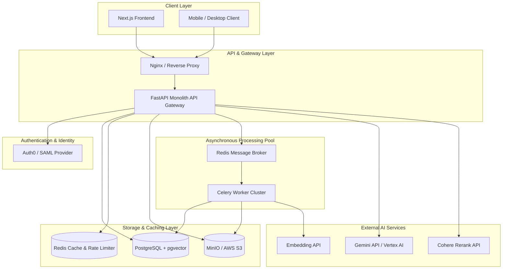
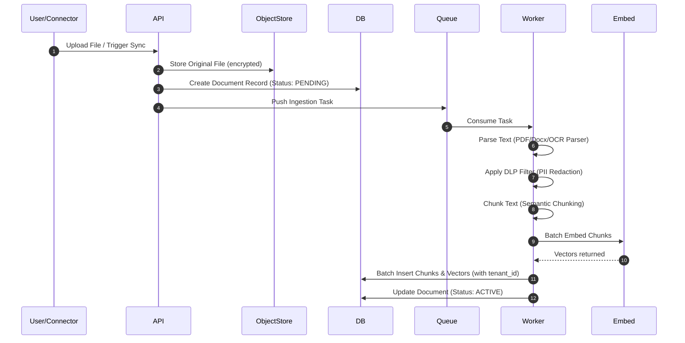
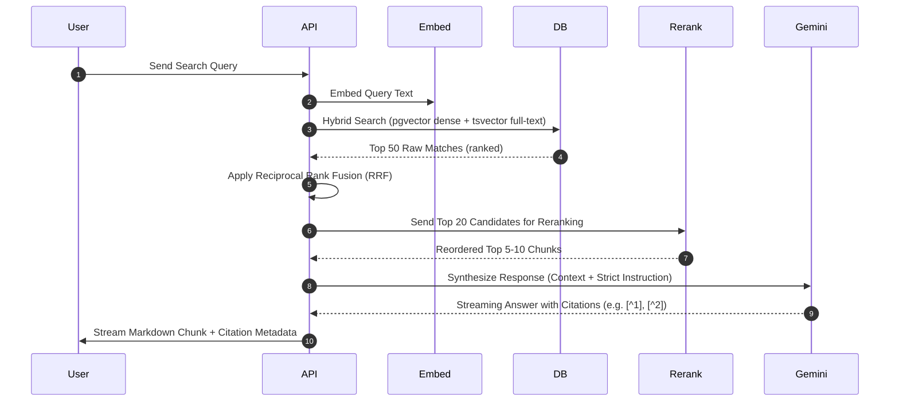
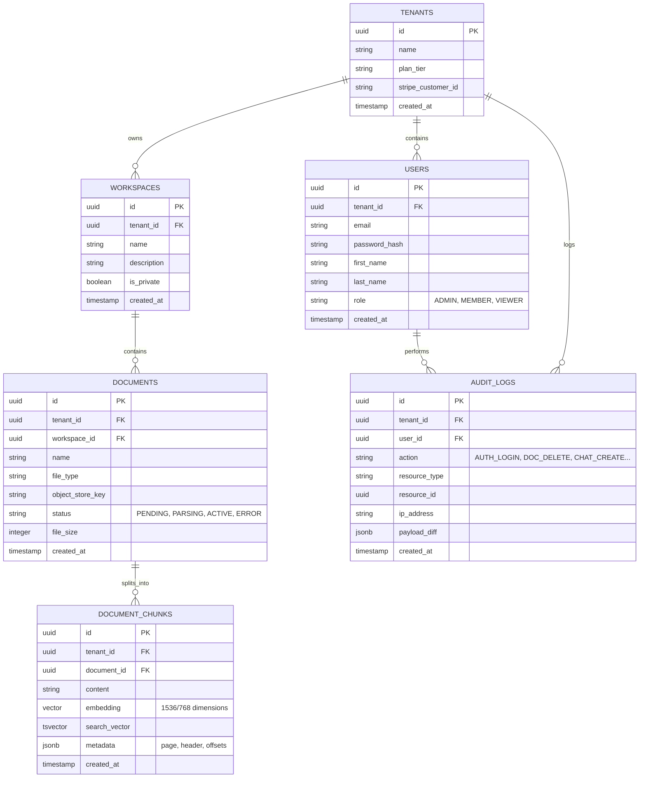

# ContextHub Product Specs & Architectural Blueprint (PLAN.md)

ContextHub is a production-grade, enterprise-ready AI Knowledge Platform designed to centralize, organize, retrieve, and automate interactions with internal organizational data. This document outlines the business positioning, system design, data architecture, and non-functional requirements.

---

## 1. Executive Summary & Business Strategy

### Product Positioning
Many organizations face the "Siloed Intelligence" problem. Crucial institutional knowledge is scattered across Google Drive, Slack, JIRA, local files, and email. General-purpose AI models cannot access this data, and building custom pipelines is complex and security-sensitive. 

**ContextHub** bridges this gap. It acts as the secure, intelligent neural network of the enterprise, allowing teams to:
1. Ingest information from standard corporate data sources automatically.
2. Organically organize content into spaces and collections.
3. Access accurate, cited information via conversational RAG.
4. Delegate work to autonomous AI agents integrated into local systems.
5. Control permissions, audit access, and prevent data leakage.

### Monetization & Packaging Model

```text
┌─────────────────────────────────┬─────────────────────────────────┬─────────────────────────────────┐
│           Starter               │            Professional         │           Enterprise            │
│  (Logical Multi-Tenancy SaaS)   │  (Logical Multi-Tenancy SaaS)   │    (Dedicated VPC / Hybrid)     │
├─────────────────────────────────┼─────────────────────────────────┼─────────────────────────────────┤
│ • Up to 20 Users                │ • Unlimited Users               │ • Dedicated Single-Tenant DB    │
│ • 10 GB Ingestion Storage       │ • 500 GB Ingestion Storage      │ • Unlimited Ingest Storage      │
│ • Shared LLM API Pool           │ • Custom API Key Integration    │ • On-Prem/VPC Private Deploy    │
│ • Basic Connectors (Drive, MD)  │ • All Connectors (JIRA, Slack)  │ • SAML/SSO Identity Federation  │
│ • Basic Chat + Citation         │ • AI Agents & custom Workflows  │ • Data Loss Prevention (DLP)    │
│ • Logical Tenant Isolation      │ • Row-Level Security Rules      │ • Strict Audit Trail Logs       │
└─────────────────────────────────┴─────────────────────────────────┴─────────────────────────────────┘
```

---

## 2. System Architecture

ContextHub is designed as an **API-First Modular Monolith** to keep development velocity high, while partitioning core logical segments so they can be extracted into microservices (e.g., the parser worker pool or the agent execution sandbox) as load demands.

### High-Level System Architecture



### Logical Data Flow Diagrams

#### 1. Ingestion Pipeline


#### 2. Query & Retrieval (Custom RAG) Pipeline


---

## 3. Database Schema Model

ContextHub uses a unified database instance with **Logical Multi-Tenancy**. PostgreSQL holds all relational, vector, audit, and system schema. 



---

## 4. Key Capabilities & Features

### 4.1 Ingestion & Content Connectors
- **Unified Document Parser:** Single core ingestion service that processes standard files (`.pdf`, `.docx`, `.md`, `.txt`, `.csv`, `.xlsx`, `.pptx`). Uses PyPDF for basic PDFs, and integrates OCR (Tesseract or Gemini Vision) for scanned documents.
- **Out-of-the-box Connectors:** Standard synchronization adapters that poll external APIs:
  - **Google Drive:** Crawls specified shared folders, watching for updates.
  - **Slack:** Archives selected channels and extracts threads.
  - **Jira / Confluence:** Syncs wiki pages and issue metadata.
  - **Web Scraper:** Recovers content from public documentation websites.

### 4.2 Custom Hybrid RAG & Grounding
- **Semantic Chunking:** Custom text-splitter that keeps Markdown tables, code blocks, and list structures intact, preventing broken search contexts.
- **RRF & Reranking:** Merges dense vector results (capturing semantic intent) and BM25/FTS Postgres results (capturing exact names, SKU numbers, or error codes) before submitting candidates to Cohere Rerank.
- **Visual Citation Highlighting:** If a PDF document chunk is cited, the API returns coordinate structures (`page`, `bounding_box`). The Next.js frontend utilizes these to highlight the exact text on a PDF render canvas alongside the chat UI.

### 4.3 AI Agents & Tool Execution
- **ReAct Execution Engine:** A custom-built agent loop that parses LLM outputs to trigger tool execution recursively.
- **Action Sandbox:** A secure backend execution service. AI Agents can call pre-configured scripts, database connections, or API endpoints.
- **Custom Tool Bindings:** Users can write simple JavaScript/Python script modules directly in the UI, enabling ContextHub to act as a custom task runner (e.g., "Look up this customer in the CRM and draft an onboarding summary").

### 4.4 Enterprise Admin & Security
- **Data Loss Prevention (DLP):** Pre-ingest scan pipeline that blocks or redacts highly sensitive variables (passwords, JWTs, credit cards, PII) based on custom tenant-defined regex rules.
- **Granular RBAC:** Users are designated as Workspace Admins, Members, or Viewers. Row-level filters ensure a user cannot search documents in a Workspace they do not have access to.
- **SSO Federation:** Multi-tenant SAML configuration allowing enterprises to authenticate users via their identity provider (Okta, Azure Active Directory).
- **Immutable Audit Trail:** Logging system capturing exact parameters of document access, ingestion metadata, configuration changes, and model queries.

---

## 5. Non-Functional Requirements

### Scalability
- **Parser Workers:** Ingestion workers scale independently using Celery. If a user uploads a 50,000-page archive, workers scale horizontally without affecting the main API server.
- **Vector Search Indexing:** PostgreSQL HNSW index building is scheduled during off-peak hours or configured to build dynamically with low latency thresholds.

### Latency Budget
- **Search Latency:** Hybrid search + Reranking must complete in under **250ms**.
- **Chat Response Time:** The first token of the LLM stream must render in the client UI in under **800ms**.

### Reliability & Compliance
- **Data Privacy:** In logically partitioned DB queries, standard integration tests execute multi-tenant separation checks periodically.
- **Telemetry & Logging:** Trace RAG failures (hallucination checks, missing contexts, failed queries) using OpenTelemetry hooks integrated with LangSmith/Arize or custom Postgres dashboards.
