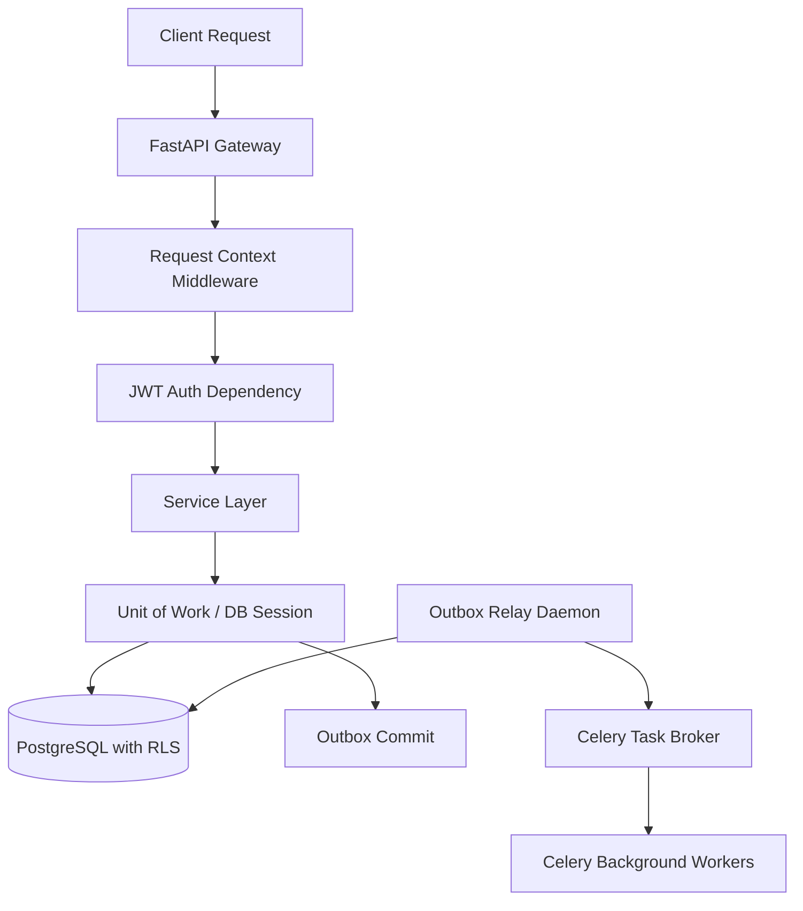
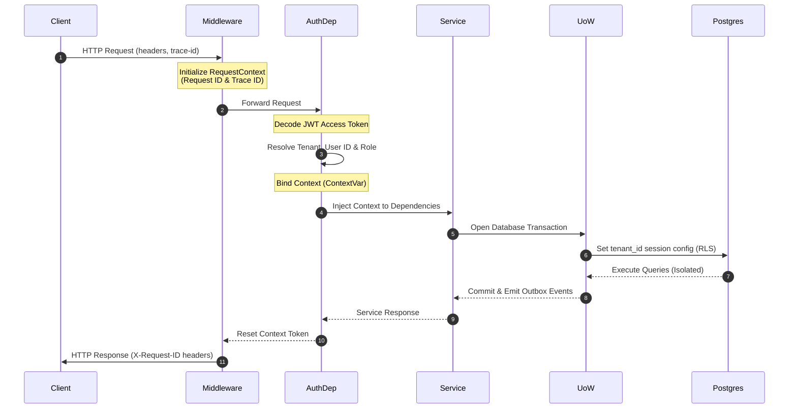
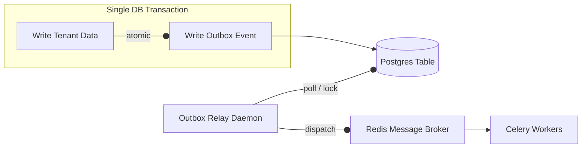
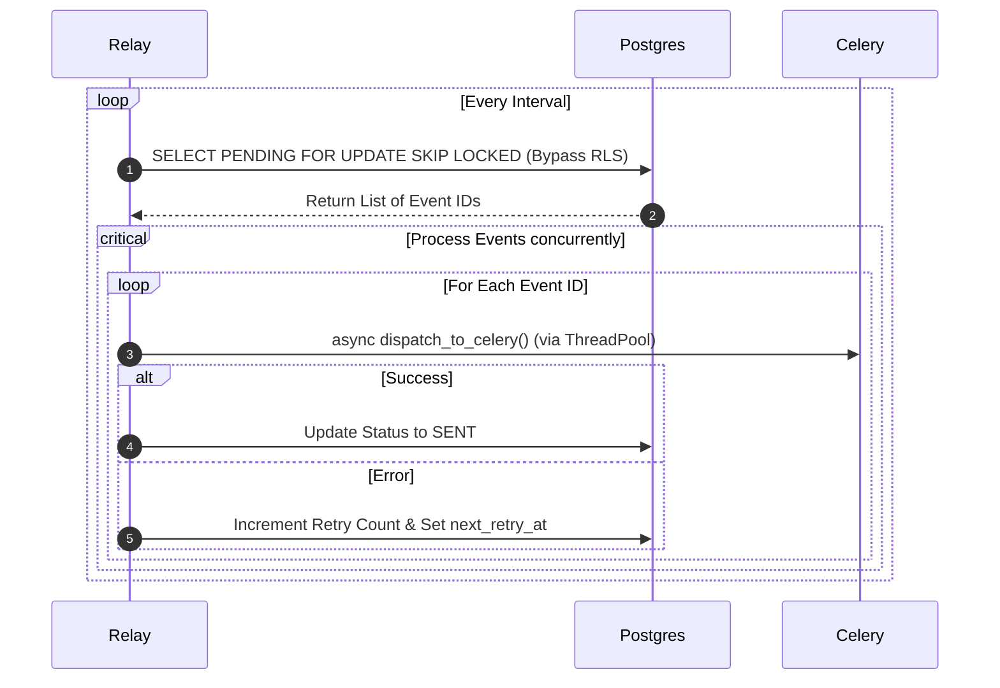

# ContextHub Core Backend Architecture

This document provides a comprehensive overview of the core backend architecture of ContextHub, detailing request lifecycles, logical multi-tenancy database isolation, transactional boundaries, domain events, and asynchronous messaging pipelines.

---

## 1. Architectural Blueprint Overview

The backend uses a clean, domain-driven modular structure designed to ensure strict separation of concerns, scalability, and logical multi-tenant data isolation.

---

## 2. Context-Aware Request Lifecycle

Every incoming HTTP request undergoes lifecycle scoping to ensure telemetry tracking (tracing) and multi-tenancy context isolation are preserved across the entire execution stack.

### Request Phase Flow
1. **Middleware Interception**: The `RequestContextMiddleware` catches the request, extracts or generates correlation IDs (`X-Request-ID` and `X-Trace-ID`), constructs the initial `RequestContext`, and binds it to a thread-safe asynchronous `ContextVar`.
2. **Auth & Identity Extraction**: The dependency injection layer resolves authentication claims from the JWT bearer token. It extracts the `tenant_id`, `user_id`, and `role`, mutates the request context, and binds the updated context to the local execution thread.
3. **Downstream Execution**: Throughout the request lifespan, any downstream service, repository, or worker retrieves the current client context synchronously via the `current_context` utility, ensuring consistent trace logging and RLS configuration.
4. **Teardown & Headers**: Upon response generation, the bound context token is reset, and the correlation headers are injected into the client HTTP response.

---

## 3. Single-Engine Database Multi-Tenancy (RLS)

ContextHub adopts a **logical multi-tenancy** architecture using a single PostgreSQL database engine where tenant isolation is enforced strictly at the database engine level via **Row-Level Security (RLS)**.

### How RLS and transactional boundaries work:
* **The Single Pool Challenge**: Using a single global connection pool means database connections are shared among different tenants. The backend must dynamically assert tenant identity before executing any statement.
* **Session Configuration**: When a transactional unit (`UnitOfWork`) starts, it requests a connection from the pool and immediately executes a localized configuration query binding the current tenant ID:
  `SET LOCAL app.tenant_id = '<current_tenant_id>'`
* **RLS Policies**: PostgreSQL tables are protected by policies checking that the row's `tenant_id` matches the session configuration (`app.tenant_id`). Any query automatically filters and protects data without developer intervention.
* **RLS Bypass**: For administrative, system-level tasks, or the Outbox Relay Daemon, the `UnitOfWork` is initialized with `is_admin=True`. This sets `app.bypass_rls = 'true'` in the transaction context, enabling query execution across all tenants.

---

## 4. Reliable Messaging: Transactional Outbox Pattern

To prevent data inconsistency and ensure messages are reliably delivered to background workers, ContextHub implements the **Transactional Outbox Pattern**.

### Flow Detail
1. **Event Capture**: When entities modify data, they record domain events locally using a mixin helper.
2. **Atomic Commits**: During database commit, the `UnitOfWork` extracts these pending events. Rather than dispatching them over the network immediately, it transforms them into `OutboxEvent` records and saves them to the global `event_outbox` database table.
3. **Guaranteed Delivery**: Because the domain data changes and outbox records are committed in the *same* database transaction, they succeed or fail together. This prevents network split issues (e.g., database writes succeed but message broker publication fails).

---

## 5. Standalone Outbox Relay Daemon

The Outbox Relay operates as a standalone daemon process separated from the web gateway server. Its job is to poll, dispatch, and clean up outbox events.

### Relay Operations Flow
* **Non-blocking Polling**: The relay runs an asynchronous loop query fetching events in `PENDING` status.
* **Concurrency Locking**: To allow multiple replicas of the relay daemon to run in parallel without message duplication, it uses database row locks:
  `SELECT ... FOR UPDATE SKIP LOCKED`
* **RLS Bypass**: The relay is a system daemon; its database operations explicitly bypass Row-Level Security checks.
* **Celery Dispatch**: Pending events are dispatched to the Redis broker for background worker execution. The I/O-blocking Celery dispatch client is executed in a worker thread pool (`asyncio.to_thread`) to prevent blocking the daemon's main asynchronous event loop.
* **State Updates**:
  * **Success**: The status is updated to `SENT`.
  * **Failure**: The error is logged, retry counters are incremented, and exponential backoff is scheduled. Events exceeding max retries are flagged as `FAILED`.

---

## 6. Container Deployment Layout

For security, performance, and portability, ContextHub separates development and production builds:

* **Production (Stateless Immutability)**:
  * Uses a clean, multi-stage Docker build.
  * In the builder stage, `uv` installs only production packages (`--no-dev`) using bind mounts (`--mount=type=bind`) to read configurations without copying files.
  * In the runtime stage, only the virtual environment and source code are copied, creating a lightweight, hardened production container without any build tools.
  * There are no host folder bindings for code in production.
* **Development (Hot-Reloading)**:
  * Uses `docker-compose.override.yml` to mount local directories (`./app`, `./tests`, etc.) directly into the running container workspace.
  * Launches the web gateway with `uvicorn --reload` to enable hot-reloading on host file changes.
