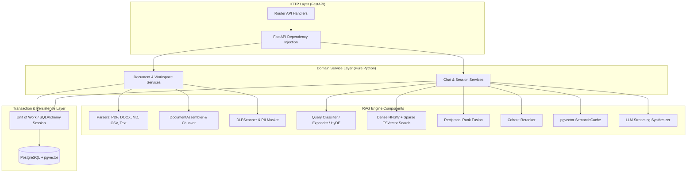
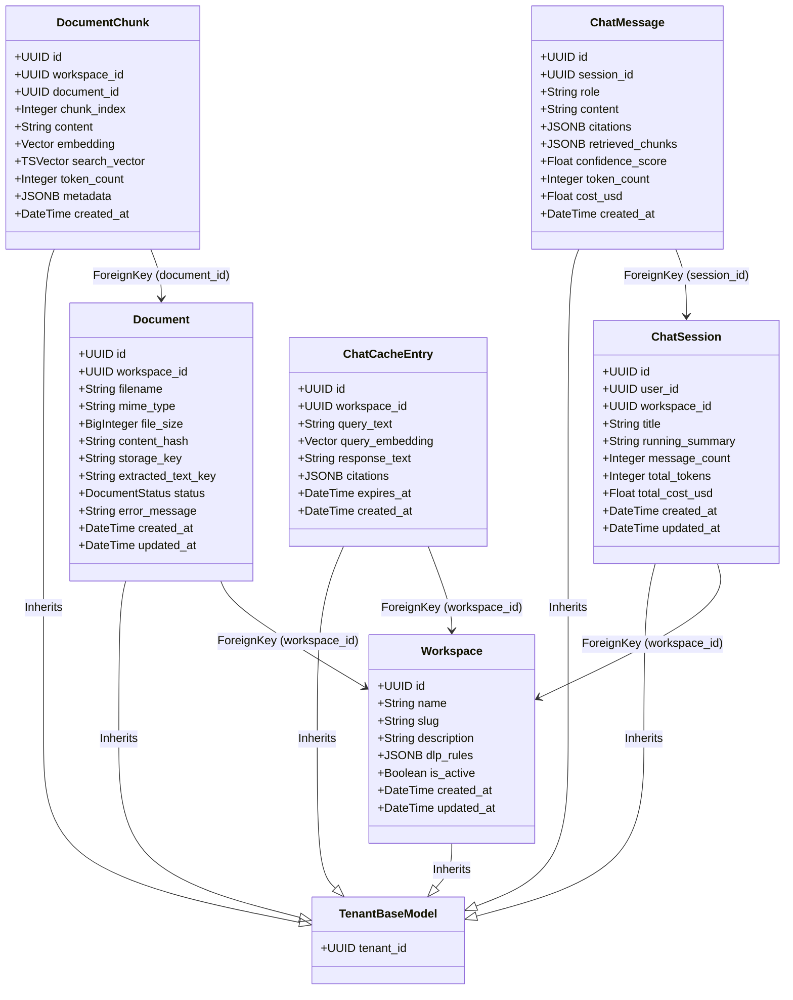
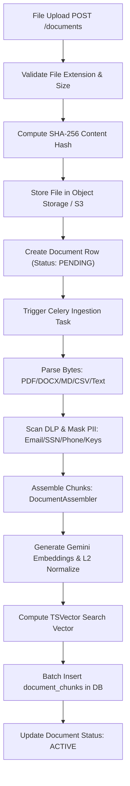
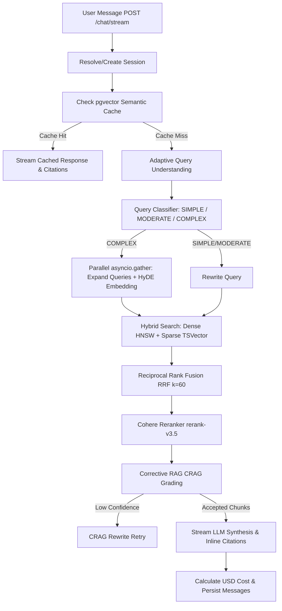

# ContextHub: Documents & Chat Modules Reference

This document provides a comprehensive technical reference for the **Documents** and **Chat** feature modules of ContextHub, including database designs, document ingestion workflows, RAG retrieval pipelines, LLM synthesis streaming, and API specifications.

---

## 1. Modular Architecture Overview

Following the core architecture guidelines, the **Documents** and **Chat** modules are organized into domain-driven layers with strict separation between HTTP-aware components (FastAPI) and pure Python business logic (Service Layer):



### Decoupling Rules
1. **Clean Service Constructors**: Services never import `Depends`, `get_uow`, or any FastAPI libraries. They are initialized purely with a `UnitOfWork` instance:
   ```python
   class ChatService:
       def __init__(
           self,
           uow: UnitOfWork,
           gemini_client: GeminiClient | None = None,
           cohere_client: CohereClient | None = None,
       ) -> None:
           self.uow = uow
           self.gemini_client = gemini_client or GeminiClient()
           self.embedder = EmbeddingProvider(client=self.gemini_client)
           self.reranker = Reranker(cohere_client=cohere_client or CohereClient())
           self.cache = SemanticCache()
           self.session_service = ChatSessionService(uow=self.uow)
   ```
2. **Local Router-level Rate Limiting & DI**: Endpoint-specific rate limiters (e.g. `chat_stream_rate_limiter` for `/chat/stream`) and DI helpers are instantiated locally in `router.py` to preserve clean layering.

---

## 2. Database Models & Schema Specifications

All workspace, document, chunk, chat session, message, and cache models inherit from `TenantBaseModel` to guarantee single-tenant RLS isolation.



### Table Specifications

#### 1. `workspaces` (Tenant-Scoped Model)
Logical container for documents and chat sessions.
* **Indexes**: `(tenant_id, slug)` (Unique), `(tenant_id)`.

#### 2. `documents` (Tenant-Scoped Model)
Represents uploaded file assets.
* **Indexes**: `(tenant_id, workspace_id)`, `(tenant_id, content_hash)` (Unique per tenant), `(tenant_id)`.

#### 3. `document_chunks` (Tenant-Scoped Model)
Atomic text chunks ready for vector and full-text search.
* **Indexes**:
  * HNSW Cosine Index: `idx_chunks_embedding_hnsw` on `embedding` (`m = 16, ef_construction = 200`).
  * GIN FTS Index: `idx_chunks_fts` on `search_vector`.
  * Foreign Keys: `(tenant_id, workspace_id)`, `(tenant_id, document_id)`.

#### 4. `chat_sessions` & `chat_messages` (Tenant-Scoped Models)
Persists conversation history, token counters, and accumulated USD costs.
* **Indexes**: `(tenant_id, workspace_id, user_id)`, `(session_id, created_at)`.

#### 5. `chat_cache` (Tenant-Scoped Model)
pgvector-backed semantic query cache.
* **Indexes**: `(tenant_id, workspace_id)`, HNSW Cosine Index on `query_embedding`.

---

## 3. Document Ingestion Pipeline



### Key Technical Components
1. **Parsers (`parsers/`)**:
   - `parse_pdf` / `parse_docx`: Extracts pages, headings, tables, and paragraph blocks.
   - `parse_csv`: Groups CSV rows into batches (default 25 rows) with `row_range` metadata and schema hash header preservation.
   - `parse_markdown` / `parse_plaintext`: Extracts headings, code blocks, and prose paragraphs.
2. **DLP Scanner (`security.py`)**:
   - Scans text using regex patterns (`SSN`, `CREDIT_CARD`, `EMAIL`, `API_KEY`, `BEARER_TOKEN`, `PHONE`, `IP_ADDRESS`).
   - `apply_dlp`: Supports `MASK`, `REJECT`, and `LOG_ONLY` workspace rules.
   - `mask_pii`: Replaces matches with deterministic tokens e.g. `[PII_EMAIL_a1b2]` and returns a token vault dictionary.
   - `unmask_pii`: Restores original unmasked text values in the final LLM response.
3. **Document Assembler (`chunkers/assembler.py`)**:
   - Preserves section lineage (`heading_trail`).
   - Computes exact, incremental character offsets (`char_start`, `char_end`) relative to full document text.
   - Preserves table headers across chunk splits.

---

## 4. Chat & Custom RAG Architecture



### RAG Pipeline Phases
1. **Semantic Cache Check**:
   - Queries `chat_cache` table using cosine distance (`threshold >= 0.95`).
2. **Query Pipeline (`query/`)**:
   - `classify_query`: Classifies query complexity based on length, comparative keywords, and conversation history.
   - `prepare_queries`: For `COMPLEX` queries, runs `expand_query` (3 variants) and `generate_hyde_embedding` in parallel via `asyncio.gather`.
3. **Hybrid Search & Fusion (`retrieval/`)**:
   - **Dense Search**: Cosine similarity over `pgvector` HNSW indexes.
   - **Sparse Search**: PostgreSQL `tsvector` full-text search matching.
   - **RRF (`fusion.py`)**: Merges ranks using Reciprocal Rank Fusion ($k=60$).
   - **Reranking (`reranker.py`)**: Re-ranks top candidates via Cohere Rerank API (`rerank-v3.5`).
   - **CRAG Grading (`grader.py`)**: Filters chunks by relevance score threshold. Returns empty accepted list with `is_low_confidence=True` when no chunks meet threshold (prevents hallucinations).
4. **LLM Synthesis & Inline Citations (`generation/`)**:
   - Prompts Gemini LLM with strict grounding rules, recent conversation history block (`L5`), and context markers `[^1]`, `[^2]`.
   - Streams SSE events (`session` $\rightarrow$ `sources` $\rightarrow$ `token` $\rightarrow$ `citations` $\rightarrow$ `done`).
   - Automatically unmasks PII tokens (`unmask_pii`).
5. **Usage & Model Pricing Utility (`utils/pricing.py`)**:
   - Parses real `usageMetadata` from Gemini SSE streams.
   - Computes USD costs dynamically via centralized `calculate_model_cost` utility and model pricing table (`MODEL_PRICING`).

---

## 5. API Endpoints Specification

### Workspace Endpoints (`/api/v1/workspaces`)
* `POST /`: Create a new workspace.
* `GET /`: List workspaces for the authenticated tenant with pagination.
* `GET /{workspace_id}`: Retrieve a single workspace.
* `PATCH /{workspace_id}`: Update workspace fields (name, description, DLP rules).

### Document Endpoints (`/api/v1/workspaces/{id}/documents`)
* `POST /`: Upload a document file (multipart/form-data) and queue Celery ingestion task.
* `GET /`: List documents in a workspace with pagination.
* `DELETE /api/v1/documents/{document_id}`: Delete a document and its vector chunks.

### Chat Endpoints (`/api/v1/chat`)
* `POST /stream`: Stream grounded RAG response via Server-Sent Events (SSE). Enforces dedicated rate limiting (`chat_stream_rate_limiter`: 10/30/60 req/min based on plan).
* `POST /sessions`: Create a new chat session.
* `GET /sessions/workspace/{workspace_id}`: List chat sessions in a workspace with pagination.
* `GET /sessions/{session_id}`: Retrieve a single chat session.
* `PATCH /sessions/{session_id}`: Update chat session details (e.g. title).
* `DELETE /sessions/{session_id}`: Delete a chat session and all history messages.
* `GET /sessions/{session_id}/messages`: List message history for a session with pagination.
