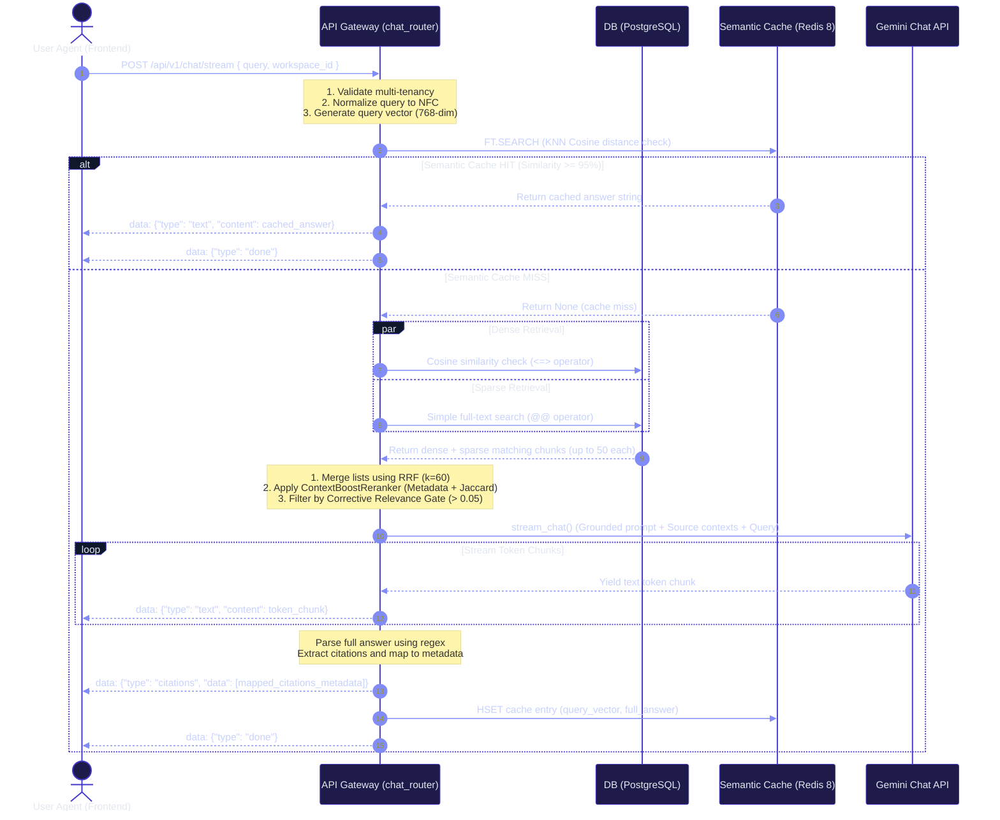

# ContextHub Custom Hybrid RAG Architecture

This document details the complete design, file structure, and logical workflows of the Custom Hybrid RAG (Retrieval-Augmented Generation) & Grounded Chat Engine implemented in ContextHub.

---

## 1. File Structure & Component Manifest

Below is the directory map showing where each part of the RAG system resides and its specific responsibility:

```text
context-hub/backend/app/
├── core/
│   ├── config.py             # Global configurations, credentials, RAG limits & thresholds
│   └── clients.py            # Async HTTP API clients (Gemini Embeddings, Gemini Chat, Cohere Rerank)
├── worker/
│   └── tasks.py              # Celery worker configuration (thin routing wrapper)
└── modules/
    └── documents/
        ├── models.py         # SQLAlchemy tables (Workspace, Document, DocumentChunk)
        ├── chunkers.py       # MarkdownStructureChunker (heading sectioning, paragraph overlaps)
        ├── semantic_cache.py # Redis 8 KNN Vector Semantic Cache VSS index manager
        ├── rerankers.py      # ContextBoostReranker (0ms CPU Matcher) & CohereReranker
        ├── retrieval.py      # Hybrid Search engine (Dense pgvector + Sparse FTS + RRF)
        ├── services.py       # Decoupled ingestion logic (process_document_ingestion)
        └── chat_router.py    # POST /api/v1/chat/stream SSE streaming chat gateway
```

---

## 2. Ingestion Pipeline Flow

The ingestion pipeline converts raw user document uploads into structured, searchable vector embeddings:


---

## 3. Retrieval & Chat Synthesis Flow

This workflow handles incoming user chat queries, executing low-cost semantic cache checks, multi-stage hybrid search, CPU-efficient reranking, and SSE streaming with inline footnote citations.



---

## 4. Key Architectural Highlights

### 1. Startup Dimension Validation (FastAPI Lifespan)
- Upon application boot, a lifespan handler runs a test embedding request with the keyword `"startup_validation"`.
- It dynamically inspects the database column configuration `DocumentChunk.embedding.type.dim` (defaulting to 768) and compares it with the length of the vector returned by the active `gemini-embedding-001` model.
- If a mismatch is detected, the server aborts startup immediately to prevent corrupt indices.

### 2. Zero-Cost Reranking (`ContextBoostReranker`)
- Avoids the expensive API charges of Cohere Rerank or the local GPU/RAM overhead of running heavy transformer models.
- Operates mathematically on CPU using lexical intersections (Jaccard overlaps) on text combined with strict matching of keywords in headings (`section_title`) and filenames.
- Outperforms standard Reciprocal Rank Fusion by ensuring that chunks matching the high-signal headers of a document are prioritized.

### 3. Decoupled Celery Worker
- Celery `tasks.py` remains a lightweight infrastructure routing wrapper.
- All core business operations (S3 uploads, text extraction, structural chunking, embedding) are located in the business logic service `services.py`, facilitating decoupled testing and clean separation of concerns.
