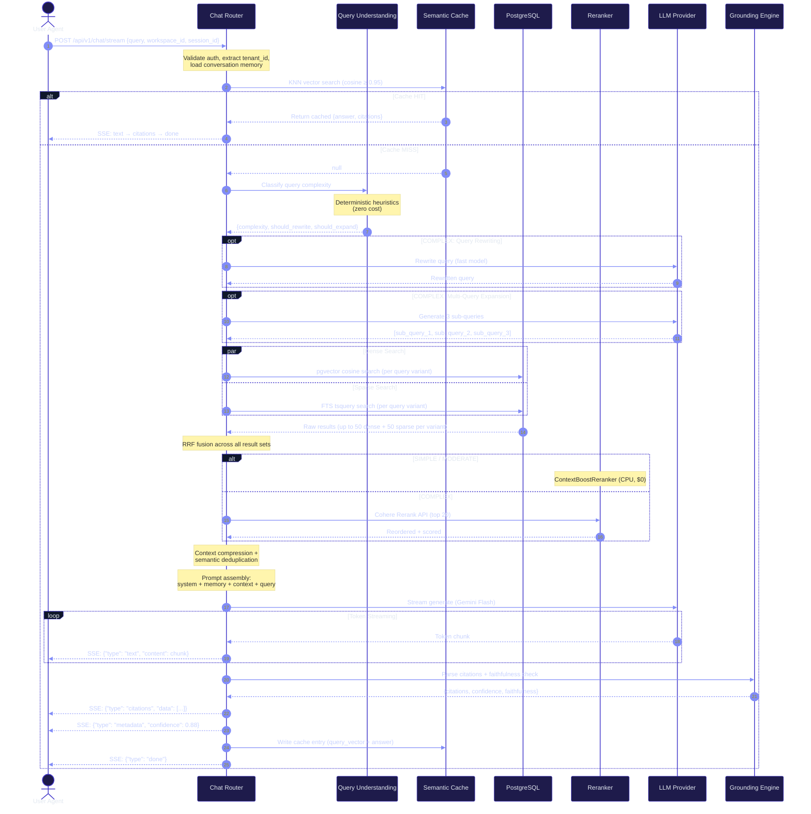

# ContextHub Enterprise RAG Architecture

> **Version:** 2.0 — Production-Grade Specification
> **Status:** Living Architecture Document
> **Scope:** Complete Retrieval-Augmented Generation system with adaptive cost routing, multi-layered retrieval, grounded citation, and enterprise security.

This document specifies the complete design of the ContextHub Custom Hybrid RAG & Grounded Chat Engine. It defines every processing layer from raw document ingestion through LLM synthesis, with explicit decision logic, fallback paths, cost optimisation strategies, and production deployment patterns.

---

## Table of Contents

1. [Architecture Philosophy & Design Principles](#1-architecture-philosophy--design-principles)
2. [Module Directory Tree](#2-module-directory-tree)
3. [End-to-End System Architecture Diagram](#3-end-to-end-system-architecture-diagram)
4. [Layer 1 — Document Ingestion Gateway](#4-layer-1--document-ingestion-gateway)
5. [Layer 2 — Parsing & Text Extraction](#5-layer-2--parsing--text-extraction)
6. [Layer 3 — DLP / PII Security Pipeline](#6-layer-3--dlp--pii-security-pipeline)
7. [Layer 4 — Adaptive Chunking Engine](#7-layer-4--adaptive-chunking-engine)
8. [Layer 5 — Metadata Enrichment](#8-layer-5--metadata-enrichment)
9. [Layer 6 — Embedding & Indexing Pipeline](#9-layer-6--embedding--indexing-pipeline)
10. [Layer 7 — Query Understanding & Routing](#10-layer-7--query-understanding--routing)
11. [Layer 8 — Hybrid Retrieval Engine](#11-layer-8--hybrid-retrieval-engine)
12. [Layer 9 — Reranking & Context Compression](#12-layer-9--reranking--context-compression)
13. [Layer 10 — Prompt Assembly & LLM Generation](#13-layer-10--prompt-assembly--llm-generation)
14. [Layer 11 — Citation Grounding & Hallucination Detection](#14-layer-11--citation-grounding--hallucination-detection)
15. [Layer 12 — Semantic & Session Cache](#15-layer-12--semantic--session-cache)
16. [Layer 13 — Conversational Memory](#16-layer-13--conversational-memory)
17. [Layer 14 — Evaluation, Observability & Telemetry](#17-layer-14--evaluation-observability--telemetry)
18. [Security & Multi-Tenancy](#18-security--multi-tenancy)
19. [Advanced Modules (Optional / Conditional)](#19-advanced-modules-optional--conditional)
20. [End-to-End Request Lifecycle](#20-end-to-end-request-lifecycle)
21. [Cost Optimisation Strategy](#21-cost-optimisation-strategy)
22. [Implementation Roadmap](#22-implementation-roadmap)
23. [Technology Recommendations](#23-technology-recommendations)
24. [Production Best Practices](#24-production-best-practices)

---

## 1. Architecture Philosophy & Design Principles

### Core Tenets

| Principle | Rule |
|---|---|
| **No Heavy Abstractions** | No LangChain, no LlamaIndex. Direct API calls with thin wrappers for transparency, debuggability, and latency control. |
| **Adaptive Cost Routing** | Expensive LLM operations (rewriting, HyDE, Self-RAG) execute **only** when confidence is low or query complexity justifies the cost. Default path uses deterministic algorithms and lightweight heuristics. |
| **Fail-Fast Determinism** | Every layer has a deterministic fallback that produces a result without any API call. The system never blocks on a single external service. |
| **Tenant-Isolated Everything** | Every database query, cache key, vector search, and LLM context window is scoped by `tenant_id`. Zero cross-tenant leakage at every layer. |
| **Observability-First** | Every decision point emits structured telemetry. Cost, latency, confidence, and quality metrics are logged at each layer boundary. |

### Adaptive Routing Philosophy

```text
┌─────────────────────────────────────────────────────────────────────┐
│                    ADAPTIVE ROUTING DECISION TREE                    │
├─────────────────────────────────────────────────────────────────────┤
│                                                                     │
│  Query arrives → Classify complexity (deterministic heuristics)      │
│                                                                     │
│  ┌─ SIMPLE (keyword lookup, exact match, FAQ)                       │
│  │  → Skip: query rewriting, HyDE, multi-query, reranking API      │
│  │  → Use: FTS + semantic cache + ContextBoostReranker (CPU)        │
│  │  → Cost: $0.00 (no LLM calls in retrieval path)                 │
│  │                                                                   │
│  ├─ MODERATE (standard semantic question)                           │
│  │  → Use: Hybrid search + RRF + CPU reranker                      │
│  │  → Skip: HyDE, multi-query expansion                            │
│  │  → Cost: 1 embedding call + 1 LLM generation call               │
│  │                                                                   │
│  └─ COMPLEX (multi-hop, ambiguous, analytical)                      │
│     → Use: Query rewriting + multi-query + HyDE (if beneficial)     │
│     → Use: API reranker (Cohere) + context compression              │
│     → Cost: N embedding calls + 1 rerank call + 1 LLM call         │
│                                                                     │
│  Confidence gate after retrieval:                                   │
│  ┌─ HIGH confidence (top chunk score > 0.85)                        │
│  │  → Stream response directly                                      │
│  ├─ MEDIUM confidence (0.45 – 0.85)                                 │
│  │  → Apply reranking, proceed with caution disclaimer              │
│  └─ LOW confidence (< 0.45)                                         │
│     → Trigger CRAG corrective step or fallback response             │
└─────────────────────────────────────────────────────────────────────┘
```

---

## 2. Module Directory Tree

The RAG system is organized into two primary domain modules under `modules/`: **documents** (ingestion, indexing, storage) and **chat** (retrieval, synthesis, memory). Shared AI infrastructure lives under `core/` and `infrastructure/`.

```text
context-hub/backend/app/
├── core/
│   ├── config.py                    # RAG thresholds, model names, feature flags
│   ├── clients.py                   # Async HTTP wrappers (Gemini, OpenAI, Cohere APIs)
│   ├── context.py                   # Request context (tenant_id, user_id, trace_id)
│   ├── database.py                  # Async SQLAlchemy engine & session factory
│   ├── events.py                    # Domain event definitions & dispatcher
│   └── exceptions.py               # Typed RAG exceptions (RetrievalError, DLPViolation)
│
├── infrastructure/
│   ├── storage.py                   # S3/MinIO async client (upload, signed URLs)
│   ├── outbox.py                    # Transactional outbox for reliable messaging
│   ├── rate_limiter.py              # Redis sliding-window rate limiter
│   └── telemetry.py                 # OpenTelemetry spans, metrics, and cost tracking
│
├── modules/
│   ├── documents/                   # ═══ INGESTION & INDEXING DOMAIN ═══
│   │   ├── models.py                # SQLAlchemy: Workspace, Document, DocumentChunk
│   │   ├── schemas.py               # Pydantic v2: request/response DTOs
│   │   ├── services.py              # Orchestrator: process_document_ingestion()
│   │   ├── repository.py            # DB access: chunk CRUD, bulk upsert, search queries
│   │   │
│   │   ├── parsers/                 # ── Layer 2: Parsing & Extraction ──
│   │   │   ├── __init__.py          # ParserRegistry: auto-detect & dispatch
│   │   │   ├── base.py              # Abstract BaseParser interface
│   │   │   ├── pdf_parser.py        # PyMuPDF4LLM: text + layout + coordinates
│   │   │   ├── docx_parser.py       # python-docx: headings, tables, lists
│   │   │   ├── markdown_parser.py   # AST-based MD parser preserving structure
│   │   │   ├── csv_parser.py        # Row-level + schema-aware parsing
│   │   │   ├── plaintext_parser.py  # .txt / .log with line-break heuristics
│   │   │   └── ocr_parser.py        # Tesseract + Gemini Vision fallback (scanned PDFs)
│   │   │
│   │   ├── chunkers/                # ── Layer 4: Adaptive Chunking ──
│   │   │   ├── __init__.py          # ChunkerFactory: select strategy per content type
│   │   │   ├── base.py              # Abstract BaseChunker interface
│   │   │   ├── structural.py        # Heading-aware sectioning (MD/DOCX)
│   │   │   ├── semantic.py          # Embedding-similarity breakpoint chunking
│   │   │   ├── sliding_window.py    # Fixed-size with paragraph-aligned overlap
│   │   │   ├── table_chunker.py     # Preserve table rows/columns as atomic units
│   │   │   └── code_chunker.py      # AST-aware chunking for code blocks
│   │   │
│   │   ├── enrichment/              # ── Layer 5: Metadata Enrichment ──
│   │   │   ├── __init__.py
│   │   │   ├── metadata.py          # Structural metadata extraction (headers, pages)
│   │   │   ├── classifier.py        # Lightweight topic/domain classification
│   │   │   └── summarizer.py        # Optional: per-chunk summary for parent retrieval
│   │   │
│   │   ├── security/                # ── Layer 3: DLP / PII Pipeline ──
│   │   │   ├── __init__.py
│   │   │   ├── scanner.py           # Regex-based PII scanner (SSN, CC, email, API key)
│   │   │   ├── masker.py            # Reversible tokenized masking engine
│   │   │   └── rules.py             # Per-workspace configurable DLP rule sets
│   │   │
│   │   ├── embeddings/              # ── Layer 6: Vectorization ──
│   │   │   ├── __init__.py
│   │   │   ├── provider.py          # Multi-provider: Gemini, OpenAI, local (configurable)
│   │   │   ├── batch.py             # Batch embedding with rate limiting & retry
│   │   │   └── normalizer.py        # L2 normalization, dimension validation
│   │   │
│   │   └── indexing/                # ── Layer 6b: Index Management ──
│   │       ├── __init__.py
│   │       ├── hnsw.py              # pgvector HNSW index lifecycle (build, tune, monitor)
│   │       └── fts.py               # tsvector generation, GIN index, language configs
│   │
│   └── chat/                        # ═══ RETRIEVAL & SYNTHESIS DOMAIN ═══
│       ├── models.py                # SQLAlchemy: ChatSession, ChatMessage, ChatFeedback
│       ├── schemas.py               # Pydantic v2: ChatRequest, ChatResponse, Citation
│       ├── router.py                # POST /api/v1/chat/stream — SSE gateway
│       ├── services.py              # Orchestrator: process_chat_query()
│       │
│       ├── query/                   # ── Layer 7: Query Understanding ──
│       │   ├── __init__.py
│       │   ├── classifier.py        # Intent + complexity classifier (deterministic)
│       │   ├── rewriter.py          # LLM query rewriting (only for COMPLEX queries)
│       │   ├── expander.py          # Multi-query expansion (fan-out for ambiguous queries)
│       │   └── hyde.py              # Hypothetical Document Embedding (conditional)
│       │
│       ├── retrieval/               # ── Layer 8: Hybrid Retrieval ──
│       │   ├── __init__.py
│       │   ├── dense.py             # pgvector cosine similarity search
│       │   ├── sparse.py            # PostgreSQL FTS (tsvector/tsquery)
│       │   ├── fusion.py            # Reciprocal Rank Fusion (RRF, k=60)
│       │   └── filters.py           # Metadata filters (workspace, doc type, date range)
│       │
│       ├── reranking/               # ── Layer 9: Reranking & Compression ──
│       │   ├── __init__.py
│       │   ├── context_boost.py     # Zero-cost CPU reranker (Jaccard + metadata match)
│       │   ├── cohere_reranker.py   # Cohere Rerank API (activated for COMPLEX only)
│       │   ├── compressor.py        # LLM-free extractive context compression
│       │   └── deduplicator.py      # Semantic deduplication of overlapping chunks
│       │
│       ├── synthesis/               # ── Layer 10: Prompt Assembly & Generation ──
│       │   ├── __init__.py
│       │   ├── prompt_builder.py    # Dynamic prompt assembly with token budgeting
│       │   ├── generator.py         # Streaming LLM call (Gemini / OpenAI)
│       │   └── templates.py         # System prompt templates (grounding, citation format)
│       │
│       ├── grounding/               # ── Layer 11: Citation & Hallucination ──
│       │   ├── __init__.py
│       │   ├── citation_parser.py   # Regex extraction of [^N] references from LLM output
│       │   ├── citation_mapper.py   # Map parsed refs → full metadata (doc, page, coords)
│       │   ├── hallucination.py     # NLI-based / overlap-based faithfulness checker
│       │   └── confidence.py        # Confidence scoring (retrieval + generation signals)
│       │
│       ├── cache/                   # ── Layer 12: Semantic & Session Cache ──
│       │   ├── __init__.py
│       │   ├── semantic_cache.py    # Redis 8 VSS KNN vector cache (cosine ≥ 0.95)
│       │   └── session_cache.py     # Short-lived per-session response cache
│       │
│       └── memory/                  # ── Layer 13: Conversational Memory ──
│           ├── __init__.py
│           ├── manager.py           # Sliding window + summary-based memory
│           └── context_builder.py   # Inject conversation history into prompt
│
├── worker/
│   ├── tasks.py                     # Celery task routing (thin wrapper)
│   └── relay.py                     # Outbox relay daemon
│
└── evaluation/                      # ── Layer 14: Offline Evaluation ──
    ├── __init__.py
    ├── retrieval_metrics.py         # Precision@K, Recall@K, MRR, NDCG
    ├── generation_metrics.py        # Faithfulness, answer relevancy, citation accuracy
    ├── cost_tracker.py              # Per-query cost aggregation & reporting
    └── synthetic_qa.py              # Synthetic Q&A pair generation for regression tests
```

---

## 3. End-to-End System Architecture Diagram

### 3.1 Complete RAG Pipeline Overview

```mermaid
%%{init: {
  'theme': 'base',
  'themeVariables': {
    'primaryColor': '#1e1b4b',
    'primaryTextColor': '#e0e7ff',
    'primaryBorderColor': '#4338ca',
    'lineColor': '#6366f1',
    'secondaryColor': '#0f172a',
    'tertiaryColor': '#1e293b',
    'edgeLabelBackground':'#312e81'
  }
}}%%
graph TB
    subgraph INGESTION ["▎ INGESTION PLANE (Async / Celery Workers)"]
        direction LR
        I1["Upload Gateway"] --> I2["Parser Registry"]
        I2 --> I3["OCR Engine"]
        I2 --> I4["Text Extractor"]
        I3 --> I5["DLP / PII Scanner"]
        I4 --> I5
        I5 --> I6["Adaptive Chunker"]
        I6 --> I7["Metadata Enrichment"]
        I7 --> I8["Batch Embedder"]
        I8 --> I9["pgvector + FTS Index"]
    end

    subgraph RETRIEVAL ["▎ RETRIEVAL PLANE (Sync / API Gateway)"]
        direction LR
        R1["Query Intake"] --> R2["Semantic Cache Check"]
        R2 -->|MISS| R3["Query Classifier"]
        R3 --> R4{"Complexity?"}
        R4 -->|SIMPLE| R5["Direct Hybrid Search"]
        R4 -->|MODERATE| R5
        R4 -->|COMPLEX| R6["Query Rewriter / Multi-Query / HyDE"]
        R6 --> R5
        R5 --> R7["RRF Fusion"]
        R7 --> R8["Reranker (CPU or API)"]
        R8 --> R9["Context Compressor"]
        R9 --> R10["Deduplicator"]
    end

    subgraph SYNTHESIS ["▎ SYNTHESIS PLANE (Streaming / SSE)"]
        direction LR
        S1["Prompt Builder"] --> S2["Token Budget Manager"]
        S2 --> S3["LLM Streaming Generator"]
        S3 --> S4["Citation Parser"]
        S4 --> S5["Hallucination Checker"]
        S5 --> S6["Confidence Scorer"]
        S6 --> S7["Response Assembler"]
        S7 --> S8["Cache Writer"]
    end

    I9 --> R5
    R10 --> S1
    R2 -->|HIT| S7

    subgraph SUPPORT ["▎ CROSS-CUTTING CONCERNS"]
        direction LR
        X1["Tenant Isolation (RLS)"]
        X2["Observability (OTel)"]
        X3["Cost Tracker"]
        X4["Audit Logger"]
        X5["Conversational Memory"]
    end

    style INGESTION fill:#0f172a,stroke:#312e81,stroke-width:2px
    style RETRIEVAL fill:#1e1b4b,stroke:#4338ca,stroke-width:2px
    style SYNTHESIS fill:#090d16,stroke:#1e1b4b,stroke-width:2px
    style SUPPORT fill:#0c0a1a,stroke:#1e1b4b,stroke-width:1px,stroke-dasharray: 5 5
```



### 3.2 Ingestion Pipeline — Detailed Flow

```mermaid
%%{init: {
  'theme': 'base',
  'themeVariables': {
    'primaryColor': '#1e1b4b',
    'primaryTextColor': '#e0e7ff',
    'primaryBorderColor': '#4338ca',
    'lineColor': '#6366f1',
    'secondaryColor': '#0f172a',
    'tertiaryColor': '#1e293b',
    'edgeLabelBackground':'#312e81'
  }
}}%%
graph LR
    subgraph PHASE_1 ["Phase 1: Intake & Storage"]
        direction TB
        A["User Upload<br/>(PDF / DOCX / MD / TXT / CSV)"] --> B["Validate file type,<br/>size, & tenant quota"]
        B --> C["Upload raw file to S3<br/>(encrypted at rest)"]
        C --> D["Create Document record<br/>(status: PENDING)"]
        D --> E["Emit DOCUMENT_UPLOADED<br/>outbox event"]
    end

    subgraph PHASE_2 ["Phase 2: Parsing & Extraction"]
        direction TB
        F["Celery worker<br/>consumes task"] --> G{"File type?"}
        G -->|PDF| H["PyMuPDF4LLM<br/>+ layout analysis"]
        G -->|Scanned PDF| I["OCR Pipeline<br/>(Tesseract → Gemini Vision)"]
        G -->|DOCX| J["python-docx<br/>heading/table extraction"]
        G -->|MD/TXT| K["AST / line-break<br/>heuristic parser"]
        G -->|CSV| L["Schema-aware<br/>row parser"]
        H --> M["NFC Normalize<br/>+ clean whitespace"]
        I --> M
        J --> M
        K --> M
        L --> M
    end

    subgraph PHASE_3 ["Phase 3: Security & Chunking"]
        direction TB
        N["DLP PII Scanner<br/>(regex patterns)"] --> O{"PII detected?"}
        O -->|MASK mode| P["Tokenized masking<br/>(reversible tokens)"]
        O -->|REJECT mode| Q["Reject chunk,<br/>log violation"]
        O -->|NONE| R["Pass through"]
        P --> S["Adaptive Chunker<br/>(structural → semantic → sliding)"]
        R --> S
        S --> T["Metadata Enrichment<br/>(headers, pages, topics)"]
    end

    subgraph PHASE_4 ["Phase 4: Vectorization & Indexing"]
        direction TB
        U["Batch Embed<br/>(gemini-embedding-001)<br/>rate-limited"] --> V["L2 Normalize &<br/>dimension validate"]
        V --> W["Bulk INSERT<br/>DocumentChunks<br/>(768-dim vectors)"]
        W --> X["Generate tsvector<br/>search_vector column"]
        X --> Y["Upload extracted.txt<br/>to S3"]
        Y --> Z["Update status → ACTIVE<br/>Emit DOCUMENT_READY event"]
    end

    E --> F
    M --> N
    T --> U

    style PHASE_1 fill:#0f172a,stroke:#312e81,stroke-width:2px
    style PHASE_2 fill:#1e1b4b,stroke:#4338ca,stroke-width:2px
    style PHASE_3 fill:#0c1425,stroke:#3730a3,stroke-width:2px
    style PHASE_4 fill:#090d16,stroke:#1e1b4b,stroke-width:2px
```



---

## 4. Layer 1 — Document Ingestion Gateway

### Responsibility
Accept file uploads, validate constraints, persist raw files, and dispatch processing tasks via the transactional outbox.

### Components
- **`documents/services.py`** — Orchestrator: validates file type/size, uploads to S3, creates DB record, emits outbox event.
- **`infrastructure/storage.py`** — S3 async client with server-side encryption (SSE-S3).
- **`infrastructure/outbox.py`** — Atomic event emission within the same DB transaction.

### Validation Rules

| Check | Rule | Rejection |
|---|---|---|
| File size | `<= MAX_FILE_SIZE_MB` (default: 20 MB) | HTTP 413 |
| File type | Allowlist: `.pdf`, `.docx`, `.md`, `.txt`, `.csv`, `.json` | HTTP 415 |
| Tenant quota | Per-tier storage limits checked against aggregate | HTTP 429 |
| Duplicate detection | SHA-256 hash compared against existing documents in workspace | HTTP 409 (optional) |

### Cost Optimisation
- **Zero LLM cost.** This layer is purely I/O and validation.
- S3 multipart upload for files > 5 MB to avoid memory pressure.
- Deduplication via content hash prevents redundant re-processing.

---

## 5. Layer 2 — Parsing & Text Extraction

### Responsibility
Convert binary file formats into structured plain text with preserved layout metadata (headings, tables, page numbers, coordinates).

### Parser Registry Pattern

```python
# documents/parsers/__init__.py
PARSER_REGISTRY: dict[str, type[BaseParser]] = {
    "application/pdf": PDFParser,
    "application/vnd.openxmlformats-officedocument.wordprocessingml.document": DocxParser,
    "text/markdown": MarkdownParser,
    "text/plain": PlaintextParser,
    "text/csv": CSVParser,
}

def get_parser(mime_type: str, has_text_layer: bool = True) -> BaseParser:
    if mime_type == "application/pdf" and not has_text_layer:
        return OCRParser()  # Fallback for scanned PDFs
    return PARSER_REGISTRY[mime_type]()
```

### Parser Specifications

| Parser | Library | Output Metadata | Fallback |
|---|---|---|---|
| **PDFParser** | PyMuPDF4LLM | `page_number`, `bounding_box`, `heading_level`, `is_table` | OCRParser if text extraction yields < 50 chars/page |
| **OCRParser** | Tesseract → Gemini Vision | `page_number`, `ocr_confidence`, `language` | Gemini Vision API if Tesseract confidence < 70% |
| **DocxParser** | python-docx | `heading_level`, `style_name`, `table_index` | PlaintextParser (raw text dump) |
| **MarkdownParser** | markdown-it-py (AST) | `heading_level`, `code_language`, `list_depth` | PlaintextParser |
| **CSVParser** | stdlib csv | `column_names`, `row_index`, `schema_hash` | PlaintextParser |

### OCR Decision Logic

```text
PDF Upload arrives
  │
  ├─ Extract text with PyMuPDF
  │   └─ chars_per_page > 50? ─── YES → Use text extraction (zero cost)
  │                                NO ↓
  ├─ Run Tesseract OCR (local, free)
  │   └─ avg_confidence > 70%? ─── YES → Use Tesseract output
  │                                 NO ↓
  └─ Call Gemini Vision API (paid, high quality)
      └─ Use Vision output with OCR confidence metadata
```

### Cost Optimisation
- **Default: zero API cost.** PyMuPDF and Tesseract are local libraries.
- Gemini Vision is the **last resort**, activated only when local OCR fails. Estimated cost: ~$0.002/page.
- OCR results are cached in S3 alongside the extracted text, so re-processing never triggers duplicate OCR calls.

---

## 6. Layer 3 — DLP / PII Security Pipeline

### Responsibility
Scan extracted text for Personally Identifiable Information and sensitive data patterns. Either mask or reject offending content based on workspace-level configuration.

### Components
- **`documents/security/scanner.py`** — Compiled regex engine scanning for configurable PII patterns.
- **`documents/security/masker.py`** — Reversible tokenized masking that replaces PII with deterministic tokens (e.g., `[PII_SSN_a7f3]`).
- **`documents/security/rules.py`** — Per-workspace rule definitions stored in DB.

### Default PII Patterns

| Pattern | Regex (simplified) | Severity |
|---|---|---|
| Social Security Number | `\b\d{3}-\d{2}-\d{4}\b` | CRITICAL |
| Credit Card (Luhn) | `\b\d{4}[\s-]?\d{4}[\s-]?\d{4}[\s-]?\d{4}\b` | CRITICAL |
| Email Address | `\b[A-Za-z0-9._%+-]+@[A-Za-z0-9.-]+\.[A-Z]{2,}\b` | HIGH |
| API Key / Bearer Token | `\b(sk-[a-zA-Z0-9]{20,})\b`, `Bearer\s+[A-Za-z0-9\-._~+/]+=*` | CRITICAL |
| Phone Number | `\b\+?1?\s*\(?\d{3}\)?[\s.-]?\d{3}[\s.-]?\d{4}\b` | MEDIUM |
| IP Address (v4) | `\b\d{1,3}\.\d{1,3}\.\d{1,3}\.\d{1,3}\b` | LOW |

### DLP Modes

| Mode | Behaviour | Config Key |
|---|---|---|
| `MASK` | Replace PII tokens with reversible placeholders. Original stored encrypted in a separate DLP vault table. | `RAG_DLP_ACTION=MASK` |
| `REJECT` | Reject the entire chunk. Log a `DLP_VIOLATION` audit event with the pattern name (not the matched value). | `RAG_DLP_ACTION=REJECT` |
| `LOG_ONLY` | Allow the chunk but emit a `DLP_WARNING` audit event. For monitoring rollouts. | `RAG_DLP_ACTION=LOG_ONLY` |
| `DISABLED` | No scanning. For development/testing only. | `RAG_DLP_ACTION=DISABLED` |

### Decision Flow

```text
Extracted text arrives
  │
  ├─ Load workspace DLP rules (cached in Redis, TTL 5 min)
  ├─ Run compiled regex scanner against full text
  │
  └─ Matches found?
      ├─ NO  → Pass through unmodified
      └─ YES → Check workspace DLP mode:
          ├─ MASK   → Replace each match with [PII_{TYPE}_{hash4}] token
          │           Store original↔token mapping in DLP vault (encrypted)
          │           Emit AUDIT_DLP_MASK event
          ├─ REJECT → Discard chunk, increment violation counter
          │           Emit AUDIT_DLP_REJECT event (pattern name only)
          └─ LOG    → Pass through, emit AUDIT_DLP_WARNING event
```

### Cost Optimisation
- **Zero API cost.** All scanning is regex-based, compiled once at startup.
- Regex patterns are pre-compiled into a single combined automaton for O(n) scanning.
- DLP rules are cached in Redis to avoid DB lookups per chunk.

---

## 7. Layer 4 — Adaptive Chunking Engine

### Responsibility
Split extracted text into semantically coherent, retrieval-optimised chunks. The strategy adapts based on document structure and content type.

### Chunking Strategy Selection

```text
Document arrives with parsed structure
  │
  ├─ Has heading hierarchy? (MD / DOCX / PDF with headers)
  │   └─ YES → StructuralChunker (heading-aware sectioning)
  │
  ├─ Contains code blocks?
  │   └─ YES → CodeChunker (AST-aware, preserve function boundaries)
  │
  ├─ Contains tables?
  │   └─ YES → TableChunker (keep rows together, schema as context header)
  │
  ├─ Long unstructured prose?
  │   └─ YES → SemanticChunker (embedding similarity breakpoints)
  │
  └─ Fallback
      └─ SlidingWindowChunker (fixed-size, paragraph-aligned overlap)
```

### Chunker Specifications

| Chunker | Target Size | Overlap | Strategy |
|---|---|---|---|
| **StructuralChunker** | 500–1500 tokens | 100 tokens (paragraph-aligned) | Split at heading boundaries. If a section exceeds max size, recursively split at sub-headings, then paragraphs. |
| **SemanticChunker** | 500–1000 tokens | 50 tokens | Compute pairwise cosine similarity between consecutive sentences. Split at similarity valleys (threshold < 0.3). |
| **SlidingWindowChunker** | 800 tokens | 100 tokens | Fixed window advancing by `size - overlap`. Break only at paragraph or sentence boundaries. |
| **TableChunker** | Entire table or 50 rows | 2 header rows | Each table becomes one chunk with schema header. If > 50 rows, split with repeated header. |
| **CodeChunker** | Per function/class | 0 | Parse code blocks with tree-sitter. Each top-level function/class is a separate chunk with file path and imports as context header. |

### Output Schema

```python
@dataclass
class ChunkResult:
    content: str                  # The chunk text
    chunk_index: int              # Position in document
    token_count: int              # Actual token count
    metadata: ChunkMetadata       # Structural metadata

@dataclass
class ChunkMetadata:
    page_numbers: list[int]       # Source page(s)
    parent_headers: list[str]     # Heading hierarchy ["Chapter 1", "Section 1.2"]
    char_start: int               # Character offset in source document
    char_end: int                 # Character offset end
    content_type: str             # "prose" | "table" | "code" | "list"
    language: str | None          # Programming language if code
    chunker_used: str             # Which chunker produced this
```

### Cost Optimisation
- **StructuralChunker and SlidingWindowChunker: zero API cost.** Pure algorithmic splitting.
- **SemanticChunker requires embeddings** for breakpoint detection. Use only for unstructured documents without heading hierarchy. Batch the sentence embeddings in a single API call.
- The `ChunkerFactory` chooses the cheapest adequate strategy first.

---

## 8. Layer 5 — Metadata Enrichment

### Responsibility
Attach structural, topical, and retrieval-boosting metadata to each chunk before embedding.

### Enrichment Steps

| Step | Implementation | Cost |
|---|---|---|
| **Structural Metadata** | Extract from parser output: page numbers, heading hierarchy, character offsets, content type. | Free (deterministic) |
| **Document-Level Metadata** | Inherit from parent document: filename, file type, workspace name, upload date, author. | Free (DB lookup) |
| **Topic Tags** (optional) | Lightweight TF-IDF or keyword extraction (top-5 terms per chunk). No LLM call. | Free (CPU) |
| **Summary** (optional, for Parent-Child retrieval) | If Parent-Child module is enabled: generate a 1-sentence summary per section using the LLM. | ~$0.001/chunk (conditional) |

### Metadata Storage
All enrichment metadata is stored in the `DocumentChunk.metadata` JSONB column:

```json
{
  "page_numbers": [3, 4],
  "parent_headers": ["Chapter 2", "Data Processing"],
  "char_start": 4500,
  "char_end": 5800,
  "content_type": "prose",
  "chunker_used": "structural",
  "topic_tags": ["data pipeline", "ETL", "validation"],
  "document_name": "Architecture Guide.pdf",
  "workspace_name": "Engineering",
  "file_type": "application/pdf"
}
```

---

## 9. Layer 6 — Embedding & Indexing Pipeline

### Responsibility
Generate dense vector embeddings for each chunk and maintain both HNSW (dense) and GIN (sparse FTS) indexes for hybrid retrieval.

### 6a. Embedding Generation

#### Provider Configuration

| Provider | Model | Dimensions | Max Batch | Cost per 1M tokens |
|---|---|---|---|---|
| **Gemini** (default) | `gemini-embedding-001` | 768 | 100 texts | ~$0.004 |
| **OpenAI** (fallback) | `text-embedding-3-small` | 1536 | 2048 texts | ~$0.020 |
| **OpenAI Large** (optional) | `text-embedding-3-large` | 3072 | 2048 texts | ~$0.130 |

#### Batch Embedding Strategy

```text
Chunks ready for embedding (N chunks)
  │
  ├─ Group into batches of 100 (Gemini) or 2048 (OpenAI)
  ├─ Apply exponential backoff retry (max 3 retries, jitter)
  ├─ Rate limit: max 1500 RPM (Gemini) / 3000 RPM (OpenAI)
  │
  ├─ On success:
  │   ├─ L2-normalize each vector
  │   ├─ Validate dimension matches DB column config
  │   └─ Bulk INSERT with ON CONFLICT DO UPDATE
  │
  └─ On persistent failure (after 3 retries):
      ├─ Mark document status as ERROR
      ├─ Emit EMBEDDING_FAILURE event for alerting
      └─ Store partial progress so retry resumes from last successful batch
```

### 6b. Index Management

#### Dense Index (HNSW)

```sql
CREATE INDEX CONCURRENTLY idx_chunks_embedding_hnsw
ON document_chunks
USING hnsw (embedding vector_cosine_ops)
WITH (m = 16, ef_construction = 200);
```

| Parameter | Value | Rationale |
|---|---|---|
| `m` | 16 | Good recall/speed tradeoff for < 10M vectors per tenant |
| `ef_construction` | 200 | Higher build quality; built async so latency doesn't matter |
| `ef_search` (query-time) | 100 | Tunable per query; higher for COMPLEX queries |

#### Sparse Index (GIN)

```sql
-- tsvector column generated at insert time
ALTER TABLE document_chunks
ADD COLUMN search_vector tsvector
GENERATED ALWAYS AS (to_tsvector('english', content)) STORED;

CREATE INDEX idx_chunks_fts ON document_chunks USING GIN (search_vector);
```

### Startup Validation
On application boot, the FastAPI lifespan handler:
1. Sends a test embedding request (`"startup_validation"`).
2. Compares the returned vector dimension against `DocumentChunk.embedding.type.dim`.
3. **Aborts startup if dimensions mismatch** to prevent corrupt indexes.

---

## 10. Layer 7 — Query Understanding & Routing

### Responsibility
Classify incoming queries by intent and complexity, then route to the minimum-cost retrieval path that achieves adequate quality.

### 7a. Query Classifier (Deterministic — Zero Cost)

The classifier runs **entirely on CPU** using heuristic rules. No LLM call.

```python
class QueryComplexity(str, Enum):
    SIMPLE = "simple"       # Direct lookup, keyword, FAQ
    MODERATE = "moderate"   # Standard semantic question
    COMPLEX = "complex"     # Multi-hop, analytical, ambiguous

def classify_query(query: str, history: list[str]) -> QueryComplexity:
    tokens = query.lower().split()
    
    # Heuristic signals
    has_comparison = any(w in tokens for w in ["compare", "versus", "vs", "difference"])
    has_multi_hop = any(w in tokens for w in ["and then", "after that", "based on"])
    has_aggregation = any(w in tokens for w in ["summarize", "list all", "overview", "analyze"])
    is_short = len(tokens) <= 5
    is_question = query.strip().endswith("?")
    has_context_dependency = any(w in tokens for w in ["it", "this", "that", "they", "them"])
    
    complexity_score = sum([
        has_comparison * 2,
        has_multi_hop * 3,
        has_aggregation * 2,
        (not is_short) * 1,
        has_context_dependency * 1,
    ])
    
    if complexity_score >= 4:
        return QueryComplexity.COMPLEX
    elif complexity_score >= 2 or (is_question and not is_short):
        return QueryComplexity.MODERATE
    return QueryComplexity.SIMPLE
```

### 7b. Adaptive Routing Table

| Complexity | Query Rewrite | Multi-Query | HyDE | Retrieval | Reranker | Est. Cost |
|---|---|---|---|---|---|---|
| **SIMPLE** | ✗ Skip | ✗ Skip | ✗ Skip | FTS primary + Dense secondary | ContextBoost (CPU) | $0.000 |
| **MODERATE** | ✗ Skip | ✗ Skip | ✗ Skip | Dense + FTS hybrid | ContextBoost (CPU) | ~$0.0001 (1 embed) |
| **COMPLEX** | ✓ LLM rewrite | ✓ 3 sub-queries | Conditional | Dense + FTS hybrid × N queries | Cohere Rerank API | ~$0.005 |

### 7c. Conditional HyDE (Hypothetical Document Embeddings)

HyDE is activated **only** when:
1. Query is classified as COMPLEX, **AND**
2. Initial retrieval returns top-1 score < 0.45 (low confidence), **AND**
3. The workspace has > 500 chunks (small corpora don't benefit from HyDE)

```text
HyDE Decision:
  complexity == COMPLEX
    AND top_1_score < 0.45
    AND workspace_chunk_count > 500
  → Generate hypothetical answer with LLM
  → Embed the hypothetical answer
  → Use hypothetical embedding for second retrieval pass
  → Merge results with original retrieval via RRF
```

**Cost:** ~$0.002 per HyDE activation (1 LLM call + 1 embedding call). Expected activation rate: < 5% of queries.

### 7d. Query Rewriting (COMPLEX only)

```text
System prompt: "Rewrite the following user query to be self-contained 
and optimized for semantic search. Resolve any pronouns using the 
conversation history. Output ONLY the rewritten query."

Input:  "What did they say about the deployment timeline?"
History: ["Previous topic was about Project Atlas migration plan"]
Output: "What is the deployment timeline for the Project Atlas migration plan?"
```

### 7e. Multi-Query Expansion (COMPLEX only)

For ambiguous queries, generate 2–3 alternative phrasings:

```text
Original: "How does authentication work?"
Expanded:
  1. "What is the authentication flow and login process?"
  2. "How are JWT tokens generated and validated?"
  3. "What SSO and SAML configurations are supported?"
```

Each sub-query runs retrieval independently. Results are merged via RRF across all sub-query result sets.

---

## 11. Layer 8 — Hybrid Retrieval Engine

### Responsibility
Execute parallel dense and sparse searches, apply metadata filters, and fuse results using Reciprocal Rank Fusion.

### 8a. Dense Search (pgvector)

```sql
SELECT id, content, metadata,
       1 - (embedding <=> $1::vector) AS cosine_score
FROM document_chunks
WHERE tenant_id = $2
  AND workspace_id = ANY($3::uuid[])
  AND ($4::text IS NULL OR metadata->>'content_type' = $4)
ORDER BY embedding <=> $1::vector
LIMIT 50;
```

- Uses HNSW index with `ef_search = 100` (tunable per complexity).
- For COMPLEX queries with multi-query expansion, `ef_search` increases to 200.

### 8b. Sparse Search (PostgreSQL FTS)

```sql
SELECT id, content, metadata,
       ts_rank_cd(search_vector, websearch_to_tsquery('english', $1)) AS fts_score
FROM document_chunks
WHERE tenant_id = $2
  AND workspace_id = ANY($3::uuid[])
  AND search_vector @@ websearch_to_tsquery('english', $1)
ORDER BY fts_score DESC
LIMIT 50;
```

- `websearch_to_tsquery` handles natural language queries with implicit AND/OR logic.
- `ts_rank_cd` uses cover density ranking for better phrase proximity scoring.

### 8c. Metadata Filters

Filters are applied as SQL WHERE clauses **before** vector search (pre-filtering) to reduce the search space:

| Filter | Source | SQL |
|---|---|---|
| Workspace scope | Request parameter | `workspace_id = ANY($3)` |
| Document type | Request parameter | `metadata->>'file_type' = $4` |
| Date range | Request parameter | `created_at BETWEEN $5 AND $6` |
| Document ID | Request parameter | `document_id = $7` |
| Content type | Automatic (code vs prose) | `metadata->>'content_type' = $8` |

### 8d. Reciprocal Rank Fusion (RRF)

```python
def reciprocal_rank_fusion(
    result_sets: list[list[ScoredChunk]],
    k: int = 60,
) -> list[ScoredChunk]:
    """Merge multiple ranked lists using RRF.
    
    RRF score = Σ 1 / (k + rank_i) for each result set where the chunk appears.
    k=60 is the standard constant that balances head vs tail contribution.
    """
    scores: dict[UUID, float] = defaultdict(float)
    chunk_map: dict[UUID, ScoredChunk] = {}
    
    for result_set in result_sets:
        for rank, chunk in enumerate(result_set, start=1):
            scores[chunk.id] += 1.0 / (k + rank)
            chunk_map[chunk.id] = chunk
    
    sorted_ids = sorted(scores, key=scores.get, reverse=True)
    return [
        replace(chunk_map[cid], rrf_score=scores[cid])
        for cid in sorted_ids
    ]
```

- For standard queries: fuse 2 lists (dense + sparse).
- For multi-query expansion: fuse 2N lists (dense + sparse per sub-query).

---

## 12. Layer 9 — Reranking & Context Compression

### Responsibility
Re-score fused candidates using higher-fidelity signals, compress context to fit token budgets, and deduplicate overlapping chunks.

### 9a. Two-Tier Reranking Architecture

```text
RRF output (top 30 candidates)
  │
  ├─ ALWAYS: ContextBoostReranker (CPU, 0ms, $0)
  │   ├─ Jaccard token overlap with query
  │   ├─ Heading keyword match bonus (+0.15)
  │   ├─ Filename keyword match bonus (+0.10)
  │   ├─ Recency bonus for newer documents (+0.05)
  │   └─ Content type relevance boost
  │
  ├─ COMPLEX queries only: CohereReranker (API, ~100ms, ~$0.002)
  │   ├─ Send top 20 candidates to Cohere Rerank v3
  │   ├─ Model: rerank-english-v3.0
  │   └─ Return reordered with relevance scores
  │
  └─ Apply Relevance Gate:
      ├─ Score > RAG_RELEVANCE_THRESHOLD (0.05) → Keep
      └─ Score ≤ threshold → Discard
```

### 9b. ContextBoostReranker (Zero-Cost CPU Reranker)

```python
def context_boost_rerank(
    query: str,
    chunks: list[ScoredChunk],
) -> list[ScoredChunk]:
    query_tokens = set(query.lower().split())
    
    for chunk in chunks:
        chunk_tokens = set(chunk.content.lower().split())
        
        # Jaccard similarity
        jaccard = len(query_tokens & chunk_tokens) / max(len(query_tokens | chunk_tokens), 1)
        
        # Heading match bonus
        heading_bonus = 0.15 if any(
            qt in (chunk.metadata.get("parent_headers", "") or "").lower()
            for qt in query_tokens
        ) else 0.0
        
        # Filename match bonus
        filename_bonus = 0.10 if any(
            qt in (chunk.metadata.get("document_name", "") or "").lower()
            for qt in query_tokens
        ) else 0.0
        
        chunk.boost_score = chunk.rrf_score + jaccard * 0.3 + heading_bonus + filename_bonus
    
    return sorted(chunks, key=lambda c: c.boost_score, reverse=True)
```

### 9c. Context Compression

After reranking, compress contexts to fit the LLM token budget:

```text
Token budget: model_context_window - system_prompt - conversation_history - safety_margin
Example: 1,048,576 - 2,000 - 3,000 - 1,000 = 1,042,576 tokens available for context

Strategy (LLM-free, deterministic):
1. Take top-K chunks sorted by rerank score
2. For each chunk, if adding it exceeds the budget:
   a. Attempt extractive compression: keep only sentences containing query keywords
   b. If still too large, truncate at the last complete sentence within budget
3. If total context is still under 30% of budget and more chunks are available,
   continue adding lower-ranked chunks
```

### 9d. Semantic Deduplication

Overlapping chunks (from sliding window overlap or multi-query results) are deduplicated:

```text
For each pair of chunks in the final context:
  - Compute token-level Jaccard similarity
  - If Jaccard > 0.7 (highly overlapping):
    - Keep the chunk with the higher rerank score
    - Discard the other
```

---

## 13. Layer 10 — Prompt Assembly & LLM Generation

### Responsibility
Construct the final prompt with system instructions, retrieved context, conversation history, and user query. Stream the LLM response via SSE.

### 10a. Prompt Structure

```text
┌─────────────────────────────────────────────────────────────────┐
│ SYSTEM PROMPT (grounding instructions + citation format)        │
├─────────────────────────────────────────────────────────────────┤
│ CONVERSATION HISTORY (last N turns, summarized if long)         │
├─────────────────────────────────────────────────────────────────┤
│ RETRIEVED CONTEXT                                               │
│                                                                 │
│ --- Source [1]: {document_name} (Page {page}) ---               │
│ {chunk_content}                                                 │
│                                                                 │
│ --- Source [2]: {document_name} (Page {page}) ---               │
│ {chunk_content}                                                 │
│                                                                 │
│ ... up to [K] sources ...                                       │
├─────────────────────────────────────────────────────────────────┤
│ USER QUERY                                                      │
│ "{original_query}"                                              │
└─────────────────────────────────────────────────────────────────┘
```

### 10b. System Prompt Template

```text
You are ContextHub, an enterprise knowledge assistant. Answer the user's 
question using ONLY the provided source documents below.

STRICT RULES:
1. Base your answer EXCLUSIVELY on the provided sources. Do not use prior knowledge.
2. If the sources do not contain enough information to answer, respond exactly:
   "I cannot find the answer in the provided documents."
3. Cite every factual claim using inline references in the format [^N] where N 
   corresponds to the source number.
4. When multiple sources support a claim, cite all of them: [^1][^3].
5. Maintain the original meaning. Do not speculate or extrapolate beyond sources.
6. Format your response in clean Markdown.
```

### 10c. Token Budget Manager

```python
def compute_token_budget(
    model: str,
    system_prompt_tokens: int,
    history_tokens: int,
    safety_margin: int = 1000,
) -> int:
    """Calculate available tokens for retrieved context."""
    model_limits = {
        "gemini-2.0-flash": 1_048_576,
        "gemini-2.5-flash": 1_048_576,
        "gpt-4o-mini": 128_000,
        "gpt-4o": 128_000,
    }
    max_ctx = model_limits.get(model, 128_000)
    return max_ctx - system_prompt_tokens - history_tokens - safety_margin
```

### 10d. Streaming Generation

```text
1. Build prompt using prompt_builder
2. Open SSE connection to client
3. Call LLM streaming API (Gemini generateContent with stream=True)
4. For each token chunk received:
   a. Emit SSE event: {"type": "text", "content": chunk}
5. After stream completes:
   a. Parse full response for citations
   b. Emit SSE event: {"type": "citations", "data": [...]}
   c. Run hallucination check (async, non-blocking)
   d. Write to semantic cache
   e. Emit SSE event: {"type": "done", "metadata": {...}}
```

---

## 14. Layer 11 — Citation Grounding & Hallucination Detection

### Responsibility
Parse LLM-generated citations, map them to source metadata, verify factual grounding, and compute confidence scores.

### 11a. Citation Pipeline

```text
LLM full response text
  │
  ├─ Regex extraction: find all [^N] patterns
  │   regex: r'\[\^(\d+)\]'
  │
  ├─ Map each N to source context metadata:
  │   {
  │     "citation_index": 1,
  │     "document_id": "uuid",
  │     "document_name": "Architecture Guide.pdf",
  │     "page_numbers": [3, 4],
  │     "section_title": "Data Processing",
  │     "excerpt": "first 200 chars of chunk...",
  │     "char_start": 4500,
  │     "char_end": 5800,
  │     "bounding_box": {...}  // For PDF highlight rendering
  │   }
  │
  └─ Emit as structured JSON in SSE citation event
```

### 11b. Hallucination Detection (Lightweight, No Extra LLM Call)

```text
Strategy: Token-overlap faithfulness check (deterministic, free)

For each sentence in the LLM response:
  1. Tokenize sentence into lemmatized word set
  2. Find the source chunk with highest token overlap
  3. Compute coverage_ratio = |sentence_tokens ∩ source_tokens| / |sentence_tokens|

Scoring:
  - coverage_ratio ≥ 0.6 → GROUNDED (sentence is supported by sources)
  - coverage_ratio 0.3–0.6 → PARTIAL (some support, may contain inference)
  - coverage_ratio < 0.3 → UNGROUNDED (potential hallucination)

Response-level faithfulness:
  faithfulness_score = count(GROUNDED sentences) / total_sentences
```

**When to escalate to LLM-based NLI check:**
- Only if `faithfulness_score < 0.5` AND query complexity is COMPLEX.
- Use a cheap model (Gemini Flash) with a focused prompt: "Does sentence X follow from context Y? Answer YES or NO."
- Expected escalation rate: < 2% of queries.

### 11c. Confidence Scoring

```python
def compute_confidence(
    top_retrieval_score: float,     # Best chunk cosine score (0-1)
    rrf_score_spread: float,        # Score gap between rank 1 and rank 5
    faithfulness_score: float,      # From hallucination check (0-1)
    citation_coverage: float,       # % of response sentences with citations (0-1)
    cache_hit: bool,                # Was this a semantic cache hit?
) -> float:
    """Composite confidence score [0, 1]."""
    if cache_hit:
        return 0.95  # Cached responses were previously validated
    
    return (
        top_retrieval_score * 0.35 +
        min(rrf_score_spread * 10, 1.0) * 0.15 +
        faithfulness_score * 0.30 +
        citation_coverage * 0.20
    )
```

| Confidence Band | Action |
|---|---|
| `≥ 0.80` | Respond normally. High trust. |
| `0.50 – 0.79` | Respond with a disclaimer: "Based on available documents..." |
| `0.30 – 0.49` | Respond with explicit uncertainty: "I found limited information..." Consider triggering CRAG if enabled. |
| `< 0.30` | Fallback: "I cannot find sufficient information in the provided documents to answer this question accurately." |

---

## 15. Layer 12 — Semantic & Session Cache

### Responsibility
Avoid redundant LLM calls by caching responses keyed on semantic similarity of queries.

### 12a. Semantic Cache (Redis 8 VSS)

```text
Architecture:
  - Redis 8 with Vector Search module (FT.CREATE, FT.SEARCH)
  - Index: one per tenant (tenant-isolated cache namespace)
  - Vector: 768-dim query embedding (same model as retrieval)
  - Similarity: Cosine distance
  - Threshold: >= 0.95 similarity = cache HIT

Cache key schema:
  tenant:{tenant_id}:sem_cache:{hash}
  
Stored fields:
  - query_vector: VECTOR (768 dims, FLOAT32)
  - query_text: TEXT
  - workspace_ids: TAG (which workspaces were in scope)
  - answer: TEXT (full LLM response)
  - citations: JSON (citation metadata array)
  - created_at: NUMERIC
  - ttl: 3600 (1 hour default, configurable)

Cache invalidation triggers:
  - Document re-ingested in workspace → flush workspace-scoped entries
  - Document deleted → flush entries citing that document
  - Workspace settings changed → flush workspace entries
  - TTL expiry → automatic
```

### 12b. Cache Lookup Flow

```text
Query arrives
  │
  ├─ Generate query embedding (768-dim)
  ├─ FT.SEARCH tenant:{tenant_id}:sem_cache_idx
  │   @workspace_ids:{workspace_id}
  │   KNN 1 @query_vector $blob
  │   RETURN 4 answer citations query_text __vector_score
  │
  ├─ Result found AND cosine_score >= 0.95?
  │   └─ YES → Return cached answer (skip all retrieval + LLM)
  │            Emit telemetry: cache_hit=true, cost=$0
  │
  └─ NO → Proceed to full retrieval pipeline
          After LLM response, write new cache entry
```

### 12c. Session Cache

Short-lived cache for within-conversation deduplication:

```text
- Key: sha256(tenant_id + session_id + normalized_query)
- TTL: 300 seconds (5 minutes)
- Purpose: Prevent duplicate LLM calls when users accidentally double-send
- Storage: Redis string (not vector — exact match only)
```

---

## 16. Layer 13 — Conversational Memory

### Responsibility
Maintain conversation context across turns without unbounded token growth.

### Memory Strategy: Sliding Window + Progressive Summarization

```text
Conversation turns: [T1, T2, T3, T4, T5, T6, T7, T8, ...]

Window size: 6 turns (configurable)

When history exceeds window:
  1. Take oldest turns outside window (T1, T2)
  2. Generate a 2-3 sentence summary using the LLM
     (piggyback on the main generation call — include as system context)
  3. Store summary in DB: ChatSession.running_summary
  4. Discard individual turn details for T1, T2
  5. Future prompts include: [summary] + [T3, T4, T5, T6, T7, T8]

Memory context injected into prompt:
  "Previous conversation summary: {running_summary}
   
   Recent messages:
   User: {T3}
   Assistant: {T4}
   ..."
```

### Memory Storage

```python
# chat/models.py
class ChatSession(TenantBase):
    id: UUID
    tenant_id: UUID
    user_id: UUID
    workspace_id: UUID
    title: str | None               # Auto-generated from first query
    running_summary: str | None      # Progressive conversation summary
    created_at: datetime
    updated_at: datetime

class ChatMessage(TenantBase):
    id: UUID
    tenant_id: UUID
    session_id: UUID                 # FK → ChatSession
    role: str                        # "user" | "assistant"
    content: str
    citations: list[dict] | None     # JSONB citation metadata
    confidence_score: float | None
    token_count: int
    cost_usd: float                  # Tracked per message
    created_at: datetime
```

---

## 17. Layer 14 — Evaluation, Observability & Telemetry

### Responsibility
Track quality metrics, cost per query, latency budgets, and RAG failure modes. Enable offline evaluation for continuous improvement.

### 14a. Online Telemetry (Per-Query)

Every query emits a structured telemetry event:

```json
{
  "trace_id": "uuid",
  "tenant_id": "uuid",
  "session_id": "uuid",
  "timestamp": "ISO-8601",
  
  "query": {
    "text": "...",
    "complexity": "MODERATE",
    "token_count": 15
  },
  
  "retrieval": {
    "dense_results": 42,
    "sparse_results": 18,
    "rrf_candidates": 30,
    "reranked_top_k": 5,
    "top_1_score": 0.87,
    "reranker_used": "context_boost",
    "cache_hit": false,
    "latency_ms": 45
  },
  
  "generation": {
    "model": "gemini-2.0-flash",
    "prompt_tokens": 3200,
    "completion_tokens": 450,
    "latency_ms": 820,
    "latency_first_token_ms": 180
  },
  
  "quality": {
    "faithfulness_score": 0.92,
    "citation_count": 3,
    "citation_coverage": 0.85,
    "confidence_score": 0.88,
    "hallucination_flags": 0
  },
  
  "cost": {
    "embedding_usd": 0.00004,
    "reranking_usd": 0.00,
    "generation_usd": 0.00065,
    "total_usd": 0.00069
  },
  
  "routing_decisions": {
    "query_rewrite": false,
    "multi_query": false,
    "hyde": false,
    "api_reranker": false,
    "hallucination_nli": false
  }
}
```

### 14b. Offline Evaluation Metrics

| Metric | Formula | Target |
|---|---|---|
| **Precision@K** | Relevant chunks in top-K / K | > 0.70 |
| **Recall@K** | Relevant chunks in top-K / Total relevant | > 0.85 |
| **MRR** | 1 / rank of first relevant result | > 0.80 |
| **NDCG@K** | Normalized Discounted Cumulative Gain | > 0.75 |
| **Faithfulness** | % of response sentences grounded in sources | > 0.90 |
| **Answer Relevancy** | Semantic similarity between query and answer | > 0.80 |
| **Citation Accuracy** | % of citations correctly mapped to supporting text | > 0.95 |

### 14c. Evaluation Pipeline

```text
1. Generate synthetic Q&A pairs from ingested documents
   (use LLM to create question + expected answer + source chunks)
2. Run queries through the full RAG pipeline
3. Compare retrieved chunks against expected source chunks (retrieval metrics)
4. Compare generated answers against expected answers (generation metrics)
5. Store results in evaluation_runs table for trend analysis
6. Alert if any metric drops below threshold between runs
```

### 14d. Cost Tracking

```python
# Per-query cost aggregation
COST_TABLE = {
    "gemini-embedding-001": {"input": 0.000004},        # per 1K tokens
    "gemini-2.0-flash": {"input": 0.00010, "output": 0.00040},
    "gemini-2.5-flash": {"input": 0.00015, "output": 0.00060},
    "rerank-english-v3.0": {"per_search": 0.002},
    "gemini-vision": {"per_page": 0.002},
}
```

### 14e. Latency Budget

| Stage | Budget | Alert Threshold |
|---|---|---|
| Semantic cache check | 5ms | 20ms |
| Query embedding | 50ms | 150ms |
| Hybrid search (dense + sparse) | 30ms | 100ms |
| RRF fusion | 2ms | 10ms |
| CPU reranking | 5ms | 20ms |
| API reranking (Cohere) | 100ms | 300ms |
| Prompt assembly | 5ms | 20ms |
| LLM first token | 200ms | 500ms |
| **Total (SIMPLE)** | **< 300ms** | **500ms** |
| **Total (MODERATE)** | **< 400ms** | **800ms** |
| **Total (COMPLEX)** | **< 1200ms** | **2000ms** |

---

## 18. Security & Multi-Tenancy

### Tenant Isolation at Every Layer

| Layer | Isolation Mechanism |
|---|---|
| **Database queries** | Row-Level Security (RLS) via `SET LOCAL app.tenant_id` on every transaction. |
| **Vector search** | `WHERE tenant_id = $1` filter in all pgvector queries. |
| **FTS search** | `WHERE tenant_id = $1` filter in all tsquery searches. |
| **Semantic cache** | Redis key namespace: `tenant:{tenant_id}:sem_cache:*` |
| **S3 storage** | Object key prefix: `tenants/{tenant_id}/documents/` |
| **LLM context** | Only chunks belonging to the tenant's workspace appear in prompts. |
| **Conversation memory** | `ChatSession.tenant_id` filter on all history queries. |
| **Audit logs** | All RAG events logged with `tenant_id` in the audit trail. |
| **DLP rules** | Per-workspace configuration scoped to tenant. |
| **Rate limiting** | Per-tenant sliding window: `rate_limit:tenant:{tenant_id}` |

### Security Checklist

- [ ] All SQL queries use parameterised SQLAlchemy ORM (no raw SQL injection).
- [ ] User query text is sanitised before FTS `tsquery` parsing.
- [ ] LLM prompts never include tenant identifiers, user emails, or system credentials.
- [ ] S3 objects use server-side encryption (SSE-S3).
- [ ] DLP scanning runs before any text is stored or embedded.
- [ ] API keys (Gemini, Cohere) are injected via environment variables, never hardcoded.
- [ ] Rate limiting prevents abuse: 60 queries/min per tenant (configurable).
- [ ] Audit log captures: who queried, what workspace, which documents were retrieved, confidence score.

---

## 19. Advanced Modules (Optional / Conditional)

These modules are **not always-on**. Each has explicit activation criteria and should be enabled only when the ROI justifies the added complexity and cost.

### 19a. GraphRAG (Knowledge Graph Enhanced Retrieval)

**What it does:** Builds a knowledge graph from extracted entities and relationships. Enables multi-hop reasoning across documents by traversing graph edges.

**When to enable:**
- Corpus contains densely interconnected entities (people, organizations, projects, regulations).
- Users frequently ask relationship questions ("Who reports to X?", "Which projects depend on Y?").
- Workspace has > 1000 documents with cross-references.

**When to skip:**
- Small corpus (< 100 documents).
- Questions are primarily single-document lookups.
- Entity extraction quality is unreliable for the domain.

**Architecture:**
```text
Ingestion addition:
  Chunks → NER extraction (spaCy / LLM) → Entity + Relation triples
  → Store in PostgreSQL edge table (entity_a, relation, entity_b, chunk_id)

Retrieval addition:
  Query → Entity extraction → Graph traversal (2-hop BFS)
  → Collect connected chunks → Merge with vector search results via RRF
```

**Cost impact:** +$0.002/document (NER extraction), +10ms/query (graph traversal).

---

### 19b. Parent-Child Retrieval

**What it does:** Stores chunks at two granularity levels. Retrieves with fine-grained child chunks (for precision) but sends parent chunks to the LLM (for context completeness).

**When to enable:**
- Documents are long-form (> 20 pages) with deep section hierarchy.
- Users report answers feel "too narrow" or "missing context."
- Faithfulness scores are high but answer relevancy is low.

**When to skip:**
- Documents are already short (< 5 pages).
- Chunks are naturally self-contained (FAQ, knowledge base articles).

**Architecture:**
```text
Ingestion:
  Document → Large parent chunks (1500 tokens, section-level)
           → Small child chunks (300 tokens, paragraph-level)
  Both embedded and indexed separately.

Retrieval:
  Query → Search child chunks (fine-grained matching)
  → For each matched child, fetch parent chunk
  → Send parent chunks to LLM (more context for synthesis)
```

**Cost impact:** ~2× embedding cost (two chunk levels), ~1.5× storage.

---

### 19c. Corrective RAG (CRAG)

**What it does:** When initial retrieval confidence is low, automatically refines the search strategy by evaluating retrieved documents for relevance and potentially broadening or narrowing the search.

**When to enable:**
- Already built into the adaptive routing as a conditional step.
- Activates when `confidence_score < 0.30` after initial retrieval.

**Architecture:**
```text
Initial retrieval → Confidence < 0.30?
  YES →
    1. Evaluate top-5 chunks: are they actually relevant? (fast LLM check)
    2. If chunks are irrelevant:
       a. Broaden search: remove metadata filters, increase top-K
       b. Try query rewriting with more context
       c. If still low confidence: return fallback response
    3. If chunks are marginally relevant:
       a. Compress and proceed with disclaimer
  NO → Proceed normally
```

**Cost impact:** +$0.001/activation (1 fast LLM evaluation). Expected activation: < 5% of queries.

---

### 19d. Self-RAG (Self-Reflective Retrieval)

**What it does:** The LLM decides mid-generation whether it needs additional retrieval. It can pause, request more context, and continue.

**When to enable:**
- Only for COMPLEX multi-hop questions where a single retrieval pass is insufficient.
- Workspace has > 2000 documents spanning multiple topics.
- Must be explicitly enabled per workspace (opt-in feature flag).

**When to skip:**
- Most workspaces. This adds significant latency and cost.
- Single-document or single-topic question answering.

**Architecture:**
```text
Generation with reflection tokens:
  LLM generates → encounters [NEED_MORE_CONTEXT] token
  → Parse reflection token
  → Extract what additional context is needed
  → Run targeted retrieval for the specific sub-question
  → Inject new context into ongoing generation
  → LLM continues
```

**Cost impact:** +2-3× LLM cost (multiple generation passes). Use only when justified.

---

### 19e. Agentic RAG (Tool-Augmented Retrieval)

**What it does:** The RAG system operates as an agent that can use tools: search different workspaces, query structured databases, run calculations, or call external APIs.

**When to enable:**
- Users need cross-workspace queries.
- Answers require computation (aggregation, comparison, date math).
- Integration with external systems (CRM, JIRA, Confluence) is configured.

**When to skip:**
- Single-workspace, simple Q&A use cases.
- No external integrations configured.

**Architecture:**
```text
Query → Agent Controller
  → Decide tool usage (deterministic router, not LLM-decided for cost control)
  → Available tools:
     - search_workspace(workspace_id, query)
     - search_all_workspaces(query)
     - get_document_metadata(document_id)
     - calculate(expression)
  → Execute tool calls in parallel where possible
  → Aggregate results
  → Synthesize final answer
```

**Cost impact:** Variable. Each tool call may trigger retrieval + LLM costs.

---

## 20. End-to-End Request Lifecycle

### Complete Query Flow (Sequence Diagram)



---

## 21. Cost Optimisation Strategy

### Per-Query Cost Breakdown by Complexity

| Cost Item | SIMPLE | MODERATE | COMPLEX |
|---|---|---|---|
| Query embedding | $0.000004 | $0.000004 | $0.000004 × N |
| Query rewrite (LLM) | — | — | ~$0.0005 |
| Multi-query expansion | — | — | ~$0.0005 |
| HyDE generation | — | — | ~$0.002 (rare) |
| Dense search (DB) | Free | Free | Free |
| Sparse search (DB) | Free | Free | Free |
| CPU reranking | Free | Free | Free |
| API reranking (Cohere) | — | — | ~$0.002 |
| LLM generation | ~$0.0004 | ~$0.0006 | ~$0.001 |
| **Total per query** | **~$0.0004** | **~$0.0006** | **~$0.006** |
| **Cache hit** | **$0.000004** | **$0.000004** | **$0.000004** |

### Cost Reduction Levers

1. **Semantic cache** — eliminates ~30-40% of LLM calls for repeated/similar queries.
2. **Adaptive routing** — 80% of queries are SIMPLE/MODERATE, avoiding expensive operations.
3. **CPU reranking default** — ContextBoostReranker replaces Cohere for 90%+ of queries.
4. **Gemini Flash** — Default to cheapest adequate model. Escalate to Pro only for Self-RAG.
5. **Batch embedding** — Amortise per-request overhead by batching ingestion embeddings.
6. **Token budget management** — Never send more context than necessary to the LLM.
7. **Session cache** — Prevent accidental double-sends within a conversation.

### Monthly Cost Estimation (Example)

| Scale | Queries/Month | Ingested Pages | Est. Monthly Cost |
|---|---|---|---|
| Small (startup) | 10,000 | 5,000 | ~$8 |
| Medium (team) | 100,000 | 50,000 | ~$65 |
| Large (enterprise) | 1,000,000 | 500,000 | ~$500 |

*Assumes 35% cache hit rate, 80% SIMPLE/MODERATE queries, Gemini pricing.*

---

## 22. Implementation Roadmap

### Phase 1: Foundation (Weeks 1–3)
- [ ] Implement `documents/parsers/` registry with PDF, MD, TXT parsers
- [ ] Implement `documents/chunkers/` with StructuralChunker and SlidingWindowChunker
- [ ] Implement `documents/security/` DLP scanner with MASK mode
- [ ] Implement `documents/embeddings/` with Gemini provider and batch processing
- [ ] Set up `documents/indexing/` with HNSW and GIN index management
- [ ] Implement `documents/services.py` ingestion orchestrator

### Phase 2: Core Retrieval (Weeks 4–6)
- [ ] Implement `chat/query/classifier.py` (deterministic complexity classifier)
- [ ] Implement `chat/retrieval/` dense, sparse, fusion, and filters
- [ ] Implement `chat/reranking/context_boost.py` (zero-cost CPU reranker)
- [ ] Implement `chat/reranking/deduplicator.py`
- [ ] Implement `chat/synthesis/` prompt builder, templates, and streaming generator
- [ ] Implement `chat/router.py` SSE endpoint

### Phase 3: Grounding & Caching (Weeks 7–8)
- [ ] Implement `chat/grounding/` citation parser, mapper, and hallucination checker
- [ ] Implement `chat/grounding/confidence.py` scoring
- [ ] Implement `chat/cache/semantic_cache.py` with Redis 8 VSS
- [ ] Implement `chat/cache/session_cache.py`
- [ ] Implement `chat/memory/` conversation manager

### Phase 4: Adaptive Intelligence (Weeks 9–10)
- [ ] Implement `chat/query/rewriter.py` (COMPLEX-only LLM rewrite)
- [ ] Implement `chat/query/expander.py` (multi-query expansion)
- [ ] Implement `chat/query/hyde.py` (conditional HyDE)
- [ ] Implement `chat/reranking/cohere_reranker.py` (COMPLEX-only)
- [ ] Implement `chat/reranking/compressor.py` (context compression)
- [ ] Integrate adaptive routing into `chat/services.py`

### Phase 5: Advanced Parsers & Evaluation (Weeks 11–12)
- [ ] Implement DOCX, CSV parsers
- [ ] Implement OCR pipeline (Tesseract → Gemini Vision fallback)
- [ ] Implement `evaluation/` retrieval and generation metrics
- [ ] Implement `evaluation/synthetic_qa.py` for regression testing
- [ ] Set up `infrastructure/telemetry.py` with OpenTelemetry

### Phase 6: Advanced Modules (Weeks 13+, Optional)
- [ ] Implement Parent-Child retrieval (when long-doc feedback warrants it)
- [ ] Implement CRAG corrective step (activate when low-confidence rate > 10%)
- [ ] Implement GraphRAG entity extraction and graph traversal
- [ ] Implement Self-RAG reflection (opt-in per workspace)
- [ ] Implement Agentic RAG tool framework

---

## 23. Technology Recommendations

### Core Stack

| Component | Technology | Rationale |
|---|---|---|
| **Embedding** | `gemini-embedding-001` (768d) | Best cost/quality ratio. Upgradeable to OpenAI `text-embedding-3-large` if needed. |
| **Generation** | `gemini-2.0-flash` | 1M context window, fast streaming, low cost. Upgrade path to `gemini-2.5-flash` for thinking. |
| **Vector Index** | pgvector HNSW | Colocated with relational data. No separate vector DB to manage. |
| **Sparse Search** | PostgreSQL tsvector/tsquery | Native, zero-dependency, battle-tested FTS. |
| **Reranking (default)** | ContextBoostReranker (CPU) | Zero cost, sub-5ms latency, good enough for 90%+ of queries. |
| **Reranking (premium)** | Cohere Rerank v3 | Best-in-class cross-encoder quality for COMPLEX queries. |
| **Caching** | Redis 8 VSS | Native vector similarity search for semantic cache. |
| **OCR** | Tesseract → Gemini Vision | Free local OCR with premium cloud fallback. |
| **PDF Parsing** | PyMuPDF4LLM | Fast, layout-aware, coordinates for citation highlighting. |
| **Background Tasks** | Celery + Redis broker | Proven at scale, integrates with outbox pattern. |
| **Observability** | OpenTelemetry + custom cost tracker | Vendor-neutral telemetry with RAG-specific cost metrics. |

### Libraries

| Purpose | Library |
|---|---|
| PDF extraction | `pymupdf4llm`, `pymupdf` |
| DOCX extraction | `python-docx` |
| Markdown parsing | `markdown-it-py` |
| OCR | `pytesseract`, `Pillow` |
| Tokenization | `tiktoken` (for token counting) |
| NLP | `spacy` (optional, for NER in GraphRAG) |
| HTTP client | `httpx` (async, for all API calls) |
| Embeddings | Direct Gemini/OpenAI REST APIs via `httpx` |

---

## 24. Production Best Practices

### Deployment

1. **Horizontal scaling**: API gateway and Celery workers scale independently. Separate deployment groups for ingestion workers (CPU/memory heavy) vs. chat API (latency-sensitive).
2. **Connection pooling**: pgBouncer in front of PostgreSQL for connection multiplexing across tenants.
3. **Index maintenance**: Schedule `REINDEX CONCURRENTLY` for HNSW indexes during off-peak hours weekly.
4. **Cache warming**: On deployment, pre-warm semantic cache with recent popular queries per tenant.

### Reliability

1. **Circuit breakers**: Wrap all external API calls (Gemini, Cohere) with circuit breakers. Fall back to CPU-only path if APIs are unavailable.
2. **Graceful degradation**: If embedding API is down, serve FTS-only results with a quality disclaimer.
3. **Idempotent ingestion**: Document processing is idempotent. Re-processing the same document replaces existing chunks (upsert on document_id + chunk_index).
4. **Dead letter queue**: Failed Celery tasks after max retries are routed to a DLQ for manual inspection.

### Monitoring & Alerting

| Metric | Alert Condition |
|---|---|
| P95 query latency | > 2000ms for 5 minutes |
| Cache hit rate | < 20% for 1 hour (potential cache invalidation storm) |
| Faithfulness score (P50) | < 0.80 for 1 hour |
| LLM API error rate | > 5% for 5 minutes |
| Ingestion failure rate | > 10% for 15 minutes |
| Cost per query (P95) | > $0.02 |
| Embedding dimension mismatch | Any occurrence → immediate alert |

### Data Lifecycle

1. **Chunk versioning**: When a document is re-ingested, old chunks are soft-deleted (marked `is_active = false`) and new chunks are inserted. This allows rollback.
2. **Cache TTL tuning**: Start with 1-hour TTL. Monitor cache hit rate and adjust. Enterprise tenants may request longer TTLs for stable knowledge bases.
3. **Audit log retention**: 90 days in hot storage (PostgreSQL), then archived to S3 in Parquet format.
4. **Embedding model migration**: When upgrading embedding models, re-embed all chunks in a background migration. Maintain backward compatibility during the transition window by running dual indexes.

---

*This architecture document is a living specification. Update it as features are implemented, patterns evolve, and production learnings emerge.*
