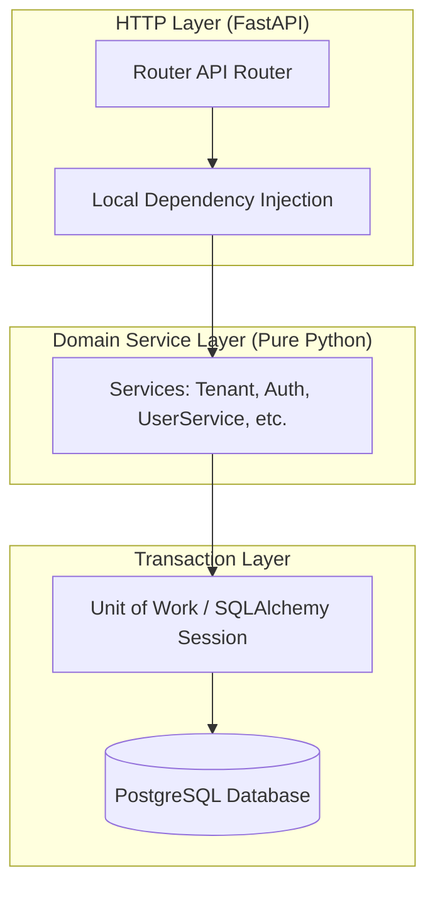
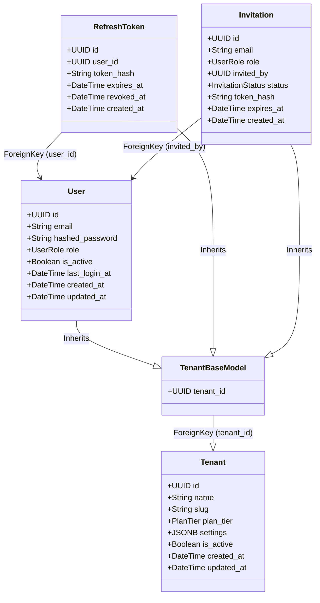
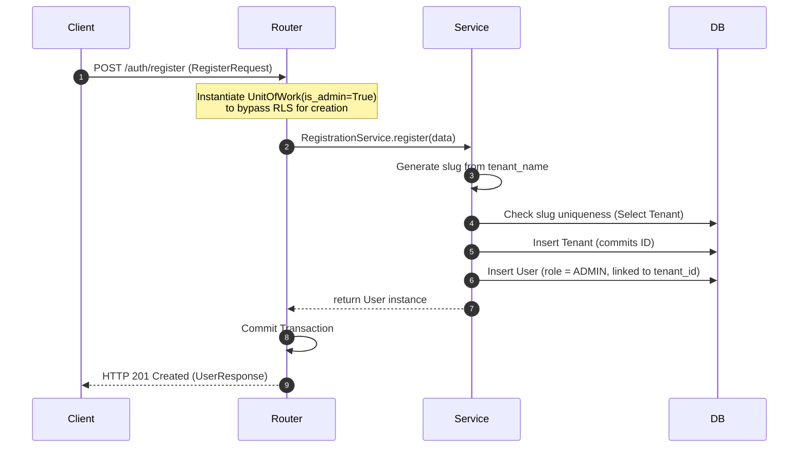
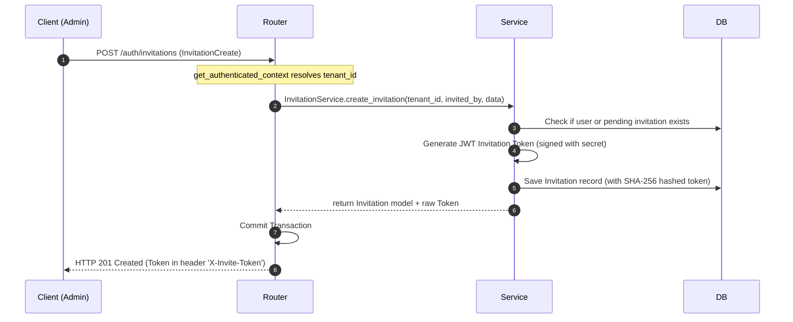

# ContextHub: Tenant & Auth Modules Reference

This document provides a detailed reference for the **Tenant** and **Auth** modules of ContextHub, including database designs, API specifications, request flows, and security guidelines.

---

## 1. Modular Architecture Overview

Following the core architecture guidelines, the **Tenant** and **Auth** modules are organized into domain-driven layers. There is a strict separation between HTTP-aware components (FastAPI) and business logic (Service layer):



### Decoupling Rules
1. **Clean Service Constructors**: Services never import `Depends`, `get_uow`, or any FastAPI libraries. They are initialized purely with a `UnitOfWork` instance:
   ```python
   def __init__(self, uow: UnitOfWork) -> None:
       self.uow = uow
   ```
2. **Local Router-level Dependencies**: FastAPI-specific DI helpers are kept local to their respective routers (`router.py`) to prevent cross-layer circular dependencies.
3. **No Repository Layer**: In alignment with reducing abstraction complexity, services directly execute optimized SQLAlchemy 2.0 statements through `self.uow.session`.

---

## 2. Database Models & Tenant Isolation

Tenant isolation is implemented using **logical multi-tenancy** on a single PostgreSQL database engine. All tenant-scoped models inherit from `TenantBaseModel`.



### Table Specifications

#### 1. `tenants` (Global Model)
Stores the root organization settings. Does not inherit from `TenantBaseModel` since it represents the tenant entities themselves.
* **Indexes**: Unique index on `slug`.

#### 2. `users` (Tenant-Scoped Model)
* **Inheritance**: Inherits `tenant_id` from `TenantBaseModel`.
* **Constraints**: Unique constraint on `(tenant_id, email)` (`uq_users_email_tenant`) to allow users to sign up to multiple organization environments using the same email address while preventing duplicates within a single tenant.
* **Indexes**: Index on `(tenant_id)` and `email`.

#### 3. `refresh_tokens` (Tenant-Scoped Model)
* **Inheritance**: Inherits `tenant_id` from `TenantBaseModel`.
* **Foreign Keys**: `user_id` pointing to `users.id` with `ondelete="CASCADE"`.
* **Indexes**: Unique index on `token_hash`.

#### 4. `invitations` (Tenant-Scoped Model)
* **Inheritance**: Inherits `tenant_id` from `TenantBaseModel`.
* **Foreign Keys**: `invited_by` pointing to `users.id` with `ondelete="SET NULL"`.
* **Indexes**: Unique index on `token_hash`.

---

## 3. Workflow Request Flows

### A. Tenant Self-Service Signup Flow
During registration, a new organization (Tenant) and its first administrator user are created atomically within a single database transaction.



### B. User Invitation Flow
Allows administrators to invite members to their organization without pre-creating password credentials.



---

## 4. API Reference Specifications

### 4.1 Tenant Management Module

#### Active Tenant Scope (`/tenant`)

* **`GET /tenant`**
  * **Auth / Scope**: Authenticated (`MEMBER`, `ADMIN`, `OWNER`)
  * **Response**: `TenantResponse`
  * **Description**: Returns detail information of the active tenant matching the requester's JWT context claims.

* **`PATCH /tenant`**
  * **Auth / Scope**: Authenticated (`ADMIN`, `OWNER` only)
  * **Request Body**: `TenantUpdate`
  * **Response**: `TenantResponse`
  * **Description**: Modifies settings or name of the active tenant. Slug modifications are blocked.

* **`GET /tenant/stats`**
  * **Auth / Scope**: Authenticated (`ADMIN`, `OWNER` only)
  * **Response**: `TenantStatsResponse`
  * **Description**: Aggregates and returns resource metrics for user count, document count, and storage bytes.

#### Global / Admin Scope (`/tenants`)

* **`GET /tenants`**
  * **Auth / Scope**: Authenticated (`SUPER_ADMIN` only)
  * **Query Params**: `offset` (int), `limit` (int), `search` (str), `order_by` (str)
  * **Response**: `PaginatedResponse[TenantResponse]`
  * **Description**: Paginated list of all tenant entities. Used for global system dashboards.

* **`GET /tenants/lookup/{slug}`**
  * **Auth / Scope**: Public (RLS Bypassed)
  * **Response**: `{"exists": bool, "name": str | None}`
  * **Description**: Fast query to assert organization existence for customized login domain routing.

* **`DELETE /tenants/{tenant_id}`**
  * **Auth / Scope**: Authenticated (`SUPER_ADMIN` only, RLS Bypassed)
  * **Response**: N/A (Status `204 No Content`)
  * **Description**: Soft-deletes a tenant (`is_active = False`). Returns `204 No Content` to signal success without disclosing the soft-deleted state details.

---

### 4.2 Authentication & User Module (`/auth`)

#### Public Authentication & Invitation Signup

* **`POST /auth/register`**
  * **Auth / Scope**: Public (Bypasses RLS)
  * **Request Body**: `RegisterRequest`
  * **Response**: `UserResponse`
  * **Description**: Registers a new Tenant organization and its first Administrator user atomically.

* **`POST /auth/login`**
  * **Auth / Scope**: Public (Bypasses RLS)
  * **Headers**: `X-Tenant-Slug` (Required)
  * **Request Body**: `LoginRequest`
  * **Response**: `TokenResponse`
  * **Description**: Authenticates email and password within the organization scope, returning access & refresh tokens.

* **`POST /auth/refresh`**
  * **Auth / Scope**: Public (Bypasses RLS)
  * **Request Body**: `RefreshRequest`
  * **Response**: `TokenResponse`
  * **Description**: Decodes and verifies a refresh token, revoking the old one and returning a new token pair.

* **`POST /auth/invitations/accept`**
  * **Auth / Scope**: Public (Bypasses RLS)
  * **Request Body**: `InvitationAccept`
  * **Response**: `UserResponse`
  * **Description**: Validates the JWT invitation token, registers the new user with the pre-determined role, and marks the invitation as accepted.

#### Authenticated User Sessions

* **`POST /auth/logout`**
  * **Auth / Scope**: Authenticated (`MEMBER`, `ADMIN`, `OWNER`)
  * **Request Body**: `RefreshRequest`
  * **Response**: N/A (Status `204 No Content`)
  * **Description**: Immediately revokes the supplied refresh token session.

* **`POST /auth/logout-all`**
  * **Auth / Scope**: Authenticated (`MEMBER`, `ADMIN`, `OWNER`)
  * **Response**: N/A (Status `204 No Content`)
  * **Description**: Revokes all active refresh token sessions belonging to the authenticated user.

#### Organization User Management

* **`GET /auth/me`**
  * **Auth / Scope**: Authenticated (`MEMBER`, `ADMIN`, `OWNER`)
  * **Response**: `UserResponse`
  * **Description**: Retrieve the current authenticated user profile.

* **`PUT /auth/users/me/password`**
  * **Auth / Scope**: Authenticated (`MEMBER`, `ADMIN`, `OWNER`)
  * **Request Body**: `ChangePasswordRequest`
  * **Response**: N/A (Status `204 No Content`)
  * **Description**: Changes the password for the active user and invalidates all current active sessions.

* **`GET /auth/users`**
  * **Auth / Scope**: Authenticated (Organization scope)
  * **Query Params**: `offset` (int), `limit` (int), `is_active` (bool)
  * **Response**: `PaginatedResponse[UserResponse]`
  * **Description**: Lists users in the organization with pagination.

* **`PATCH /auth/users/{user_id}/role`**
  * **Auth / Scope**: Admin / Owner
  * **Request Body**: `UserUpdate`
  * **Response**: `UserResponse`
  * **Description**: Modifies a user's role. Admins cannot change their own roles, nor demote the last active admin.

* **`POST /auth/users/{user_id}/deactivate`**
  * **Auth / Scope**: Admin / Owner
  * **Response**: N/A (Status `204 No Content`)
  * **Description**: Soft deactivates a user's account and revokes all active refresh token sessions.

* **`POST /auth/users/{user_id}/reactivate`**
  * **Auth / Scope**: Admin / Owner
  * **Response**: N/A (Status `204 No Content`)
  * **Description**: Restores access to a deactivated user account.

#### Organization Invitations

* **`POST /auth/invitations`**
  * **Auth / Scope**: Admin / Owner
  * **Headers**: Returns the raw signed token inside the `X-Invite-Token` header.
  * **Request Body**: `InvitationCreate`
  * **Response**: `InvitationResponse`
  * **Description**: Creates a new pending user invitation.

* **`GET /auth/invitations`**
  * **Auth / Scope**: Admin / Owner
  * **Response**: `PaginatedResponse[InvitationResponse]`
  * **Description**: Lists all active and accepted invitations issued by the tenant organization.

* **`POST /auth/invitations/{invitation_id}/revoke`**
  * **Auth / Scope**: Admin / Owner
  * **Response**: N/A (Status `204 No Content`)
  * **Description**: Revokes a pending invitation by updating its status to `REVOKED`.

* **`POST /auth/invitations/{invitation_id}/resend`**
  * **Auth / Scope**: Admin / Owner
  * **Response**: `InvitationResponse`
  * **Description**: Extends invitation expiration by 7 days and issues a new signed invitation token.

---

## 5. Security & Verification Rules

1. **Password Hashing**: Done using **Bcrypt** (12 salt rounds). Plaintext password length is capped at 72 bytes to prevent Bcrypt buffer overflow bypass.
2. **Session Revocation**: Password updates, deactivations, and manual logouts immediately update the `revoked_at` field of `refresh_tokens`, forcing users to re-authenticate on all devices.
3. **RLS Enforcement**:
   - Normal endpoints use `get_uow` which initializes `is_admin=False`. This isolates the transaction context using PostgreSQL Row Level Security.
   - Public/admin bypass routes use `UnitOfWork(..., is_admin=True)` explicitly.
4. **Preventing Locked-Out Tenants**:
   - The system prevents demoting or deactivating the **last remaining active Administrator** within a tenant organization to avoid locked-out states.
